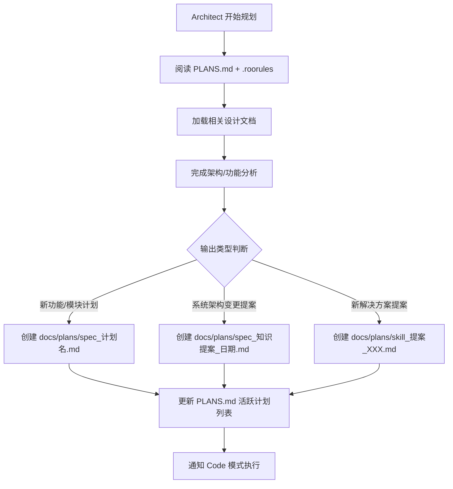

# 🏗️ Harness 架构指南（Architect 模式专属）

> **目的**：让 Architect 模式了解本项目的 Harness 架构（OpenAI AGENTS.md 模式），并在架构规划后正确输出计划与设计文档。

---

## 1. Harness 架构总览

本项目采用 **OpenAI AGENTS.md 专业架构**，文件结构如下：

```
📁 d:/wzy/Python/vivo-project/
├── .roorules                    # AGENTS.md · 总路由（渐进式披露入口）
├── ARCHITECTURE.md              # 系统架构（技术栈、目录结构、数据流、缓存、容灾）
├── docs/
│   ├── design/
│   │   ├── yield_domain.md      # 良率分析域设计
│   │   ├── spc_domain.md        # SPC 控制域设计
│   │   ├── shared_kernel.md     # 共享内核设计
│   │   ├── development_framework.md  # 开发框架（EPCC Flow、TDD 纪律、红线约束）
│   │   └── business_boundary.md # 业务边界（已实现 & 待规划）
│   ├── plans/
│   │   └── PLANS.md             # 计划总览（活跃计划 & 已完成计划）
│   └── prompt/                  # AI Agent Prompt 模板
├── skills/                      # RooCode Skills（专项解决方案）
└── src/                         # 源码
```

---

## 2. 架构规划输出规范

### 2.1 架构/功能规划完成后

在完成架构分析或功能规划后，**必须**将规划结果输出到以下位置：

| 输出类型 | 目标文件 | 说明 |
|----------|----------|------|
| **新计划** | [`docs/plans/spec_计划名.md`](docs/plans/) | 在 `docs/plans/` 下创建计划文档 |
| **系统架构变更** | [`ARCHITECTURE.md`](ARCHITECTURE.md) | 更新系统级架构描述（通过 Code 模式执行） |
| **业务设计变更** | [`docs/design/`](docs/design/) 对应文件 | 更新领域级设计文档（通过 Code 模式执行） |
| **Skills 提案** | [`docs/plans/skill_提案_XXX.md`](docs/plans/) | 先输出提案，经确认后合并到 `skills/` |

### 2.2 计划文档模板

```markdown
# 计划：[计划名称]

## 目标
（一句话描述本次计划要达成的目标）

## 涉及文件清单
- `路径`: 变更说明

## 执行步骤
1. Step 1：...
2. Step 2：...
3. Step 3：...

## 预期产出
- 产出 1
- 产出 2

## 风险评估
- 风险 1：...
- 风险 2：...
```

---

## 3. 前置操作

在开始任何架构规划前，**必须先执行以下操作**：

1. **阅读 [`docs/plans/PLANS.md`](docs/plans/PLANS.md)** — 了解当前已有计划，避免重复
2. **阅读 [`.roorules`](.roorules)** — 了解总路由中的渐进式披露表，确定需要加载哪些设计文档
3. **根据任务类型加载对应设计文档**：
   - 涉及 Yield 相关 → 加载 [`docs/design/yield_domain.md`](docs/design/yield_domain.md)
   - 涉及 SPC 相关 → 加载 [`docs/design/spc_domain.md`](docs/design/spc_domain.md)
   - 涉及基础设施 → 加载 [`docs/design/shared_kernel.md`](docs/design/shared_kernel.md)
   - 涉及开发流程 → 加载 [`docs/design/development_framework.md`](docs/design/development_framework.md)
   - 涉及边界判断 → 加载 [`docs/design/business_boundary.md`](docs/design/business_boundary.md)

---

## 4. 输出流转规则



---

## 5. 与 Code 模式的协作

| 阶段 | Architect 职责 | Code 职责 |
|------|----------------|-----------|
| **规划** | 分析需求、输出 Plan / Design | — |
| **实施** | — | 读取 Plan / Design 进行编码 |
| **验证** | 审核实施结果 | 运行测试、确保 100% PASS |
| **总结** | — | 执行知识归纳流程（`.roo/rules-code/knowledge-summarization.md`） |

> **关键约束**：Architect 模式不直接修改代码文件。架构变更需要通过 `docs/plans/` 中的提案文件传递给 Code 模式执行。

---

## 6. 多 Agent 协作流（EPCC Flow）

本项目采用 EPCC Flow（Explore → Plan → Code → Commit）的协作模式：

1. **Explore（探索）** — 分析需求、查询现有文档
2. **Plan（规划）** — 输出到 `docs/plans/` 和 `docs/design/`
3. **Code（编码）** — 读取 Plan 并实施
4. **Commit（提交）** — 验证测试、提交代码

> 详细 EPCC Flow 说明请参考：[`docs/design/development_framework.md`](docs/design/development_framework.md)
