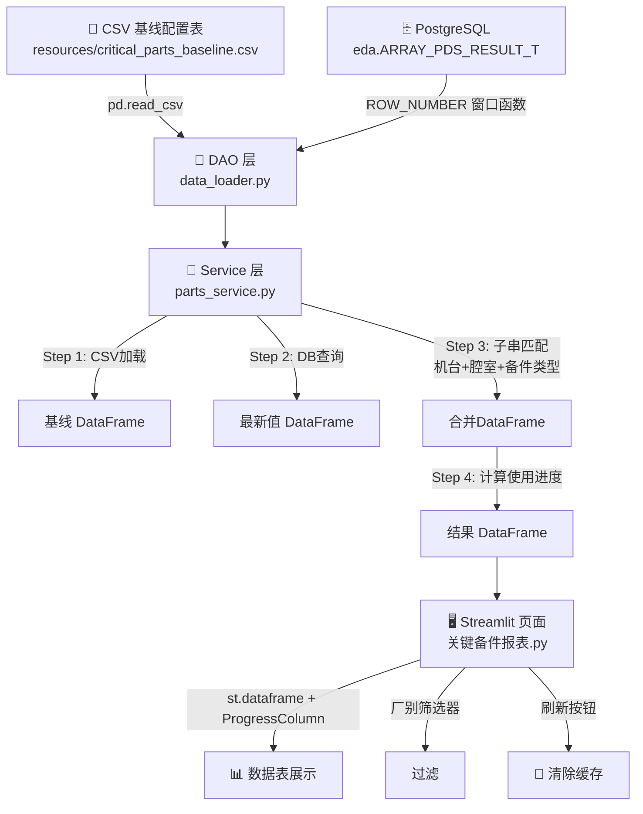
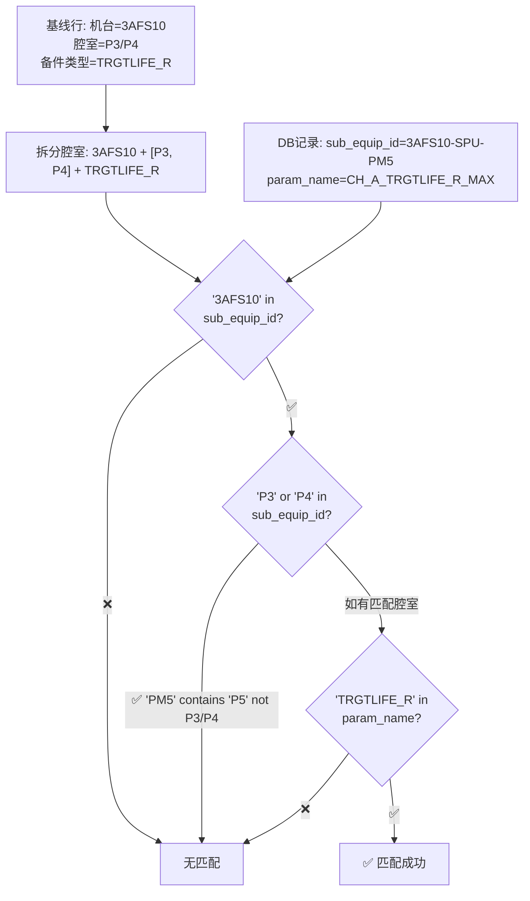

# 关键备件报表 · 开发方案 Spec

> **项目**: 天柱专项报表系统  
> **模块**: 关键备件报表 (Critical Parts Report)  
> **版本**: v2.0  
> **日期**: 2026-05-15

---

## 目录

- [1. 需求概述](#1-需求概述)
- [2. 数据流架构](#2-数据流架构)
- [3. 文件清单与职责](#3-文件清单与职责)
- [4. 详细设计](#4-详细设计)
  - [4.1 规格配置表 — CSV 基线](#41-规格配置表--csv-基线)
  - [4.2 DAO 层 — 数据加载](#42-dao-层--数据加载)
  - [4.3 Service 层 — 核心匹配逻辑](#43-service-层--核心匹配逻辑)
  - [4.4 UI 层 — Streamlit 页面](#44-ui-层--streamlit-页面)
- [5. 关键SQL](#5-关键sql)
- [6. 匹配规则详解](#6-匹配规则详解)
- [7. TDD 测试计划](#7-tdd-测试计划)
- [8. 实施路线图 (Todo)](#8-实施路线图-todo)

---

## 1. 需求概述

### 1.1 业务背景

面板 Array 制程中有大量设备备件（RF 电极、Gas 喷头、Mask 等），每类备件有**寿命规格**（如 840HR）。需要从数据库捞取实际使用数据（如 `TRGTLIFE_R_MAX` 参数值），与寿命规格对比，计算**使用进度百分比**，实现备件寿命预警。

### 1.2 输入：规格配置表

用户提供原始 Excel（含合并单元格和图片）→ 本 Spec 将其重构为**干净的 CSV 基线表**存放于 `resources/critical_parts_baseline.csv`，包含以下列：

| 列名 | 来源 | 说明 |
|------|------|------|
| 厂别 | CSV 静态配置 | 如 ARRAY |
| 膜层 | CSV 静态配置 | 如 CVD |
| 制程 | CSV 静态配置 | 如 PE |
| 机台 | CSV 静态配置 | 设备机台代号，如 `3AFS10` |
| 腔室 | CSV 静态配置 | 腔室标识，如 `P3/P4`（斜杠表示多腔室通用） |
| 备件类型 | CSV 静态配置 | 如 `TRGTLIFE_R`、`MASKLIFE_G` |
| 寿命规格 | CSV 静态配置 | 额定寿命小时数，如 `840` |
| 预警值(%) | CSV 静态配置 | 触发预警的百分比阈值，默认 `80` |
| **实际数据** | **DB 查询** | | **系统填充** |
| **使用进度(%)** | **计算字段** | **实际数据 / 寿命规格 × 100%** |
| **测量时间** | **DB 查询** | **glass_start_time** |
| **预警状态** | **计算字段** | **使用进度 >= 预警值 → '⚠️ 超预警'，否则 '✅ 正常'** |

### 1.3 数据源：数据库实时值

SQL 从 [`eda.ARRAY_PDS_RESULT_T`](../src/equipment_domain/infrastructure/data_loader.py) 表中，按腔室分组取最新一条记录。返回字段：

| SQL 字段 | 映射到报表 | 说明 |
|----------|-----------|------|
| `step_id` | 站点/膜层 | 用于识别工艺站点 |
| `sub_equip_id` | 机台号-腔室 | 如 `3AFS10-SPU-PM5` |
| `param_name` | 参数名称 | 如 `CH_A_TRGTLIFE_R_MAX` |
| `value` | 实际数据 | 测量值（数值型） |
| `glass_start_time` | 测量时间 | 最近一次测量时间戳 |

### 1.4 输出功能清单

| # | 功能 | 说明 |
|---|------|------|
| 1 | **概览统计卡片** | 总备件数、超预警数、正常数、最后更新时间 |
| 2 | **数据表格** | CSV 全部字段 + 实际数据 + 使用进度(ProgressColumn进度条) + 预警状态 |
| 3 | **厂别筛选器** | 下拉选择厂别（如 ARRAY）过滤数据 |
| 4 | **数据刷新按钮** | `st.button('🔄 刷新数据')` 清空 L2 缓存 + 重新查询 |

---

## 2. 数据流架构



### 2.1 领域归属

创建独立领域包 [`equipment_domain`](../src/equipment_domain/)，不混入 Yield/SPC 领域：

```
src/
└── equipment_domain/               # [新] 设备备件领域
    ├── __init__.py
    ├── application/
    │   ├── __init__.py
    │   └── parts_service.py         # Service：数据加载 + 匹配 + 计算
    └── infrastructure/
        ├── __init__.py
        └── data_loader.py           # DAO：CSV读取 + SQL查询
```

---

## 3. 文件清单与职责

| # | 文件路径 | 操作 | 职责 |
|---|---------|------|------|
| 0 | `resources/critical_parts_baseline.csv` | **新建** | 备件规格基线配置表（见 4.1 节） |
| 1 | `src/equipment_domain/__init__.py` | **新建** | 领域包标记 |
| 2 | `src/equipment_domain/infrastructure/__init__.py` | **新建** | 基础设施层标记 |
| 3 | `src/equipment_domain/infrastructure/data_loader.py` | **新建** | DAO：`load_spec_baseline()` + `load_latest_part_life()` |
| 4 | `src/equipment_domain/application/__init__.py` | **新建** | 应用层标记 |
| 5 | `src/equipment_domain/application/parts_service.py` | **新建** | Service：`PartsReportService.get_report_data()` |
| 6 | `app/pages/关键备件报表.py` | **新建** | Streamlit 页面 |
| 7 | `tests/unit/test_equipment_parts.py` | **新建** | 单元测试 |
| 8 | `tests/integration/test_equipment_parts_db.py` | **新建** | 集成测试 |

### 3.1 文件依赖关系

```
app/pages/关键备件报表.py
  └── src/equipment_domain/application/parts_service.py
        ├── src/equipment_domain/infrastructure/data_loader.py
        │     ├── resources/critical_parts_baseline.csv
        │     └── src/shared_kernel/infrastructure/db_handler.py (DatabaseManager)
        └── pandas (子串匹配 + 合并 + 计算)
```

---

## 4. 详细设计

### 4.1 规格配置表 — CSV 基线

**文件**: [`resources/critical_parts_baseline.csv`](../resources/critical_parts_baseline.csv)

#### 4.1.1 数据内容

根据用户提供的原始图片提取，共 12 行规格数据：

```csv
厂别,膜层,制程,机台,腔室,备件类型,寿命规格,预警值
ARRAY,CVD,PE,3AFS10,P3/P4,TRGTLIFE_R,840,80
ARRAY,CVD,PE,3AFS10,P3/P4,TRGTLIFE_G,840,80
ARRAY,CVD,PE,3AFS10,P3/P4,TRGTLIFE_B,840,80
ARRAY,CVD,PE,3AFS10,P3/P4,MASKLIFE_R,840,80
ARRAY,CVD,PE,3AFS10,P3/P4,MASKLIFE_G,840,80
ARRAY,CVD,PE,3AFS10,P3/P4,MASKLIFE_B,840,80
ARRAY,CVD,PE,3AFS10,P5,TRGTLIFE_R,840,80
ARRAY,CVD,PE,3AFS10,P5,TRGTLIFE_G,840,80
ARRAY,CVD,PE,3AFS10,P5,TRGTLIFE_B,840,80
ARRAY,CVD,PE,3AFS10,P5,MASKLIFE_R,840,80
ARRAY,CVD,PE,3AFS10,P5,MASKLIFE_G,840,80
ARRAY,CVD,PE,3AFS10,P5,MASKLIFE_B,840,80
```

#### 4.1.2 字段说明

| 列名 | 类型 | 说明 | 示例 |
|------|------|------|------|
| 厂别 | str | 工厂/厂区 | ARRAY |
| 膜层 | str | 薄膜工艺层 | CVD |
| 制程 | str | 工艺类型 | PE |
| 机台 | str | 设备机台代号 | 3AFS10 |
| 腔室 | str | 腔室标识，斜杠`/`表示多腔室共用规格 | P3/P4, P5 |
| 备件类型 | str | 备件测量参数类型 | TRGTLIFE_R, MASKLIFE_G |
| 寿命规格 | int | 额定寿命（小时） | 840 |
| 预警值 | int | 触发预警的使用进度百分比阈值 | 80 |

> **扩展性**: 后续增加新备件时，只需在 CSV 中追加行即可，无需改代码。

### 4.2 DAO 层 — 数据加载

**文件**: [`src/equipment_domain/infrastructure/data_loader.py`](../src/equipment_domain/infrastructure/data_loader.py)

#### 4.2.1 `load_spec_baseline(baseline_path: str | Path) -> pd.DataFrame`

```python
def load_spec_baseline(baseline_path: str | Path) -> pd.DataFrame:
    """
    加载 CSV 规格基线表。
    
    [防御性设计]
    - 文件不存在 → FileNotFoundError 友好提示
    - 必要列缺失 → ValueError 列出缺失列名
    - 数值列异常 → pd.to_numeric(errors='coerce') 容错
    
    必要列: {厂别, 膜层, 制程, 机台, 腔室, 备件类型, 寿命规格, 预警值}
    """
```

#### 4.2.2 `load_latest_part_life(db_manager: 'DatabaseManager') -> pd.DataFrame`

```python
def load_latest_part_life(db_manager: 'DatabaseManager') -> pd.DataFrame:
    """
    执行窗口函数 SQL，从 eda.ARRAY_PDS_RESULT_T 
    获取每个腔室最新的备件寿命数据。
    
    返回列: step_id, sub_equip_id, param_name, value, glass_start_time
    
    [防御性设计]
    - db_manager.engine is None → 日志警告 + 返回空 DataFrame
    - SQL 异常 → try-except + 返回空 DataFrame
    - value 列 → pd.to_numeric(errors='coerce')
    - 列名 → 统一小写
    """
    sql = """
    SELECT step_id, sub_equip_id, param_name, value, glass_start_time
    FROM (
        SELECT
            B.step_id,
            B.sub_equip_id,
            B.value,
            B.glass_start_time,
            B.param_name,
            ROW_NUMBER() OVER(
                PARTITION BY B.sub_equip_id 
                ORDER BY B.glass_start_time DESC
            ) as rn
        FROM eda.ARRAY_PDS_RESULT_T B
        WHERE 
            (param_name LIKE '%TRGTLIFE%_MAX' OR param_name LIKE '%MASKLIFE%_MAX')
            AND B.sub_equip_id LIKE '%PM%'
    ) T
    WHERE T.rn = 1
    """
```

### 4.3 Service 层 — 核心匹配逻辑

**文件**: [`src/equipment_domain/application/parts_service.py`](../src/equipment_domain/application/parts_service.py)

#### 4.3.1 视图模型

```python
@dataclass
class PartsReportViewModel:
    """备件报表视图模型"""
    report_df: pd.DataFrame       # 最终报表 DataFrame
    total_count: int              # 总条数
    warning_count: int            # 超预警条数
    last_update: str              # 数据最后更新时间（ISO格式）
```

#### 4.3.2 匹配算法

**核心难点**: CSV 基线表是"规格定义"，DB 记录是"实测值"，两者**不存在直接的外键**可精确 JOIN。需要基于子串匹配（Substring Matching）建立关联。

匹配策略（按优先级）：

```python
def _match_db_to_spec(
    db_row: pd.Series,          # 一条 DB 记录 (sub_equip_id, param_name, ...)
    spec_df: pd.DataFrame       # 全部基线规格
) -> pd.Series | None:
    """
    对一条 DB 记录，在基线表中找到匹配的规格行。
    
    匹配规则（AND 逻辑）:
    1. 机台匹配: spec.机台 是 db.sub_equip_id 的子串
       e.g., '3AFS10' in '3AFS10-SPU-PM5' ✅
    2. 腔室匹配: spec.腔室 是 db.sub_equip_id 的子串
       e.g., 'P5' in '3AFS10-SPU-PM5' ✅
       e.g., 'P3/P4' → split by '/' → ['P3','P4'] → any match ✅
    3. 备件类型匹配: spec.备件类型 是 db.param_name 的子串
       e.g., 'TRGTLIFE_R' in 'CH_A_TRGTLIFE_R_MAX' ✅
    
    返回: 匹配到的 spec 行 (Series)，若未匹配返回 None
    """
```

主流程：

```python
class PartsReportService:

    @staticmethod
    @st.cache_data  # L2 缓存（遵循项目红线）
    def get_report_data(
        _db_manager,
        baseline_path: str,
        snapshot_signature: str
    ) -> PartsReportViewModel:
        
        # 1. 加载基线 CSV
        spec_df = load_spec_baseline(baseline_path)
        
        # 2. 查询数据库最新值
        latest_df = load_latest_part_life(_db_manager)
        
        # 3. 子串匹配合并
        matched_rows = []
        for _, spec_row in spec_df.iterrows():
            # 对每条规格，在 DB 记录中找匹配
            matched_db = _find_matching_db_record(spec_row, latest_df)
            
            if matched_db is not None:
                actual_value = matched_db['value']
                measure_time = matched_db['glass_start_time']
            else:
                actual_value = None
                measure_time = None
            
            # 组装结果行
            matched_rows.append({...})
        
        report_df = pd.DataFrame(matched_rows)
        
        # 4. 计算使用进度和预警状态
        report_df['使用进度'] = report_df['实际数据'] / report_df['寿命规格'] * 100
        report_df['使用进度'] = report_df['使用进度'].clip(upper=100)  # 上限100%
        report_df['预警状态'] = np.where(
            report_df['使用进度'] >= report_df['预警值'],
            '⚠️ 超预警',
            '✅ 正常'
        )
        
        # 5. 统计
        warning_count = (report_df['预警状态'] == '⚠️ 超预警').sum()
        last_update = report_df['测量时间'].max() if not report_df.empty else ''
        
        return PartsReportViewModel(
            report_df=report_df,
            total_count=len(report_df),
            warning_count=warning_count,
            last_update=str(last_update) if not pd.isna(last_update) else ''
        )
```

#### 4.3.3 核心匹配函数细节

```python
def _find_matching_db_record(
    spec_row: pd.Series,
    db_df: pd.DataFrame
) -> pd.Series | None:
    """
    对一条规格行，在 DB 结果中查找匹配的最近记录。
    
    匹配逻辑:
    1. 腔室拆分: 'P3/P4' → ['P3', 'P4'] 逐个匹配
    2. 过滤条件:
       - sub_equip_id 包含 机台 AND 腔室
       - param_name 包含 备件类型
    3. 若有多个匹配，取 glass_start_time 最新的那条
    """
    machine = str(spec_row['机台']).strip()
    chambers = str(spec_row['腔室']).strip().split('/')
    part_type = str(spec_row['备件类型']).strip()
    
    def _matches(row):
        sub_id = str(row['sub_equip_id']).upper()
        p_name = str(row['param_name']).upper()
        # 机台匹配
        if machine.upper() not in sub_id:
            return False
        # 腔室匹配（任一腔室匹配即可）
        if not any(ch.upper().strip() in sub_id for ch in chambers):
            return False
        # 备件类型匹配
        if part_type.upper() not in p_name:
            return False
        return True
    
    matched = db_df[db_df.apply(_matches, axis=1)]
    if matched.empty:
        return None
    # 取最新的一条
    return matched.loc[matched['glass_start_time'].idxmax()]
```

### 4.4 UI 层 — Streamlit 页面

**文件**: [`app/pages/关键备件报表.py`](../app/pages/关键备件报表.py)

#### 页面布局

```
┌─────────────────────────────────────────────────────────────────┐
│  📋 关键备件报表                              [🔄 刷新数据]      │
├─────────────────────────────────────────────────────────────────┤
│  🔽 厂别筛选: [ARRAY  ▼]                                        │
├─────────────────────────────────────────────────────────────────┤
│  📊 概览                                                        │
│  ┌───────────┐ ┌───────────┐ ┌───────────┐ ┌───────────────┐  │
│  │  总备件数   │ │  超预警    │ │  正常      │ │  最后更新      │  │
│  │    12      │ │     3     │ │    9      │ │ 2026-05-15    │  │
│  └───────────┘ └───────────┘ └───────────┘ └───────────────┘  │
├─────────────────────────────────────────────────────────────────┤
│  数据表（带使用进度条）                                          │
│  ┌────┬────┬────┬────┬────┬──────┬────┬────┬─────┬────┬──────┐│
│  │厂别│膜层│... │机台│腔室│备件..│寿命│预警│实际 │进度│ 状态 ││
│  ├────┼────┼────┼────┼────┼──────┼────┼────┼─────┼────┼──────┤│
│  │ARRAY│CVD│...│3AFS│P5  │TRGT..│840 │80% │ 735│ 87%│⚠️超预││
│  │     │    │    │10   │    │LIFE_R│    │    │    │████│警    ││
│  └────┴────┴────┴────┴────┴──────┴────┴────┴─────┴────┴──────┘│
└─────────────────────────────────────────────────────────────────┘
```

#### 核心代码骨架

```python
# app/pages/关键备件报表.py
import streamlit as st
import pandas as pd
from pathlib import Path
from datetime import datetime

from src.shared_kernel.infrastructure.db_handler import DatabaseManager
from src.equipment_domain.application.parts_service import PartsReportService

st.set_page_config(page_title="关键备件报表", layout="wide")
st.title("📋 关键备件报表")

BASELINE_PATH = Path("resources/critical_parts_baseline.csv")

# --- 数据刷新按钮 ---
col_title, col_refresh = st.columns([6, 1])
with col_refresh:
    if st.button("🔄 刷新数据", use_container_width=True):
        st.cache_data.clear()
        st.rerun()

# --- 厂别筛选 ---
spec_df = pd.read_csv(BASELINE_PATH)
factories = spec_df['厂别'].unique().tolist()
selected_factory = st.selectbox("厂别筛选", factories)

# --- 快照签名（缓存失效用）---
sig_key = "parts_snapshot_sig"
if sig_key not in st.session_state:
    st.session_state[sig_key] = str(BASELINE_PATH.stat().st_mtime)
snapshot_sig = st.session_state[sig_key]

# --- 加载数据 ---
db_manager = DatabaseManager()
with st.spinner("正在加载备件数据..."):
    view_model = PartsReportService.get_report_data(
        _db_manager=db_manager,
        baseline_path=str(BASELINE_PATH),
        snapshot_signature=snapshot_sig
    )

# --- 厂别过滤 ---
filtered_df = view_model.report_df[
    view_model.report_df['厂别'] == selected_factory
].copy()

# --- 概览统计 ---
col1, col2, col3, col4 = st.columns(4)
col1.metric("总备件数", len(filtered_df))
warning_count = (filtered_df['预警状态'] == '⚠️ 超预警').sum()
col2.metric("超预警", warning_count, delta_color="inverse")
col3.metric("正常", len(filtered_df) - warning_count)
col4.metric("最后更新", view_model.last_update)

# --- 数据表（带使用进度条）---
st.dataframe(
    filtered_df,
    column_config={
        "使用进度": st.column_config.ProgressColumn(
            "使用进度 (%)",
            help="实际数据 / 寿命规格 × 100%",
            format="%.0f%%",
            min_value=0,
            max_value=100,
        ),
        "预警状态": st.column_config.TextColumn("预警状态"),
        "实际数据": st.column_config.NumberColumn("实际数据", format="%.0f"),
        "寿命规格": st.column_config.NumberColumn("寿命规格", format="%.0f"),
        "预警值": st.column_config.NumberColumn("预警值 (%)", format="%.0f%%"),
    },
    column_order=[
        "厂别", "膜层", "制程", "机台", "腔室",
        "备件类型", "寿命规格", "预警值",
        "实际数据", "使用进度", "预警状态", "测量时间"
    ],
    hide_index=True,
    use_container_width=True,
)
```

---

## 5. 关键SQL

### 5.1 最终版 SQL（已修正 TRGTLIFE）

```sql
SELECT step_id, sub_equip_id, param_name, value, glass_start_time
FROM (
    SELECT
        B.step_id,
        B.sub_equip_id,
        B.value,
        B.glass_start_time,
        B.param_name,
        ROW_NUMBER() OVER(
            PARTITION BY B.sub_equip_id 
            ORDER BY B.glass_start_time DESC
        ) as rn
    FROM eda.ARRAY_PDS_RESULT_T B
    WHERE 
        (param_name LIKE '%TRGTLIFE%_MAX' OR param_name LIKE '%MASKLIFE%_MAX')
        AND B.sub_equip_id LIKE '%PM%'
) T
WHERE T.rn = 1
```

### 5.2 字段映射

| SQL 字段 | 映射目标 | 匹配用途 |
|----------|---------|---------|
| `step_id` | — | 信息展示，暂不用于匹配 |
| `sub_equip_id` | 解析出「机台」「腔室」 | 与基线 CSV 的 `机台` + `腔室` 子串匹配 |
| `param_name` | 解析出「备件类型」 | 与基线 CSV 的 `备件类型` 子串匹配 |
| `value` | `实际数据` | 直接填充到报表 |
| `glass_start_time` | `测量时间` | 展示 + 取最新记录判断 |

---

## 6. 匹配规则详解

由于 CSV 基线表是"规格定义"，DB 记录是"实测数据"，两者通过**基于子串的规则匹配**关联，而非数据库 JOIN。

### 6.1 匹配流程图



### 6.2 示例匹配

| 基线行 | DB 记录 | 匹配结果 |
|--------|---------|---------|
| 机台=3AFS10, 腔室=P3/P4, 类型=TRGTLIFE_R | sub_equip_id=`3AFS10-SPU-PM3`, param_name=`CH_A_TRGTLIFE_R_MAX` | ✅ P3 匹配 |
| 机台=3AFS10, 腔室=P3/P4, 类型=TRGTLIFE_R | sub_equip_id=`3AFS10-SPU-PM4`, param_name=`CH_A_TRGTLIFE_R_MAX` | ✅ P4 匹配 |
| 机台=3AFS10, 腔室=P3/P4, 类型=TRGTLIFE_R | sub_equip_id=`3AFS10-SPU-PM5`, param_name=`CH_A_TRGTLIFE_R_MAX` | ❌ 腔室不匹配（P5 不在 [P3, P4] 中） |
| 机台=3AFS10, 腔室=P5, 类型=TRGTLIFE_G | sub_equip_id=`3AFS10-SPU-PM5`, param_name=`CH_A_TRGTLIFE_G_MAX` | ✅ P5 + TRGTLIFE_G 匹配 |

---

## 7. TDD 测试计划

### 7.1 单元测试 [`tests/unit/test_equipment_parts.py`](../tests/unit/test_equipment_parts.py)

| # | 测试用例 | 预期 |
|---|---------|------|
| 1 | `test_load_spec_baseline_success` | 读取 CSV 返回正确的 DataFrame，包含全部必要列 |
| 2 | `test_load_spec_baseline_file_not_found` | 文件不存在 → FileNotFoundError |
| 3 | `test_load_spec_baseline_missing_columns` | 缺少列 → ValueError 列出缺失列名 |
| 4 | `test_match_exact_machine_chamber_part` | 精确匹配：机台+腔室+备件类型全部命中 |
| 5 | `test_match_split_chamber_p3_p4` | P3/P4 → DB P3 或 P4 均匹配 |
| 6 | `test_match_no_machine` | 机台不匹配 → 返回 None |
| 7 | `test_match_no_chamber` | 腔室不匹配 → 返回 None |
| 8 | `test_match_no_part_type` | 备件类型不匹配 → 返回 None |
| 9 | `test_compute_usage_warning` | 使用进度 >= 预警值 → '⚠️ 超预警' |
| 10 | `test_compute_usage_normal` | 使用进度 < 预警值 → '✅ 正常' |
| 11 | `test_compute_usage_clip_100` | 使用进度 > 100% → clip 到 100% |
| 12 | `test_empty_db_result` | DB 无数据 → 实际数据为 NaN |

### 7.2 集成测试 [`tests/integration/test_equipment_parts_db.py`](../tests/integration/test_equipment_parts_db.py)

| # | 测试用例 | 预期 |
|---|---------|------|
| 1 | `test_db_query_returns_columns` | SQL 返回包含 step_id, sub_equip_id, param_name, value, glass_start_time |
| 2 | `test_db_row_number_unique` | 同一 sub_equip_id 在结果中最多出现一次 |
| 3 | `test_full_pipeline` | CSV → DB → 匹配 → 计算 全链路执行成功 |
| 4 | `test_parts_report_viewmodel` | ViewModel 字段不为空，统计数字正确 |

---

## 8. 实施路线图 (Todo)


| 步骤 | 任务 | 产出物 | 说明 |
|------|------|--------|------|
| **1** | 创建 CSV 基线表 | `resources/critical_parts_baseline.csv` | 基于图片提取的 12 行规格数据 |
| **2** | 创建领域包 | `equipment_domain/` 目录 + `__init__.py` | 4 个空包文件 |
| **3** | DAO 层 | `data_loader.py` | `load_spec_baseline()` + `load_latest_part_life()` |
| **4** | Service 层 | `parts_service.py` | 子串匹配 + 计算 + ViewModel |
| **5** | Streamlit 页面 | `关键备件报表.py` | 厂别筛选 + 刷新按钮 + 概览卡片 + 进度条表格 |
| **6** | 单元测试 | `test_equipment_parts.py` | 12 个单元测试用例 |
| **7** | 集成测试 | `test_equipment_parts_db.py` | 4 个集成测试用例 |
| **8** | 全量测试 | `uv run pytest tests/ -v --tb=short` | 100% PASS |

---

> **文档版本**: v2.0  
> **维护人**: 天柱专项团队  
> **更新说明**: 
> - v2.0: 根据用户反馈完善了字段匹配规则、CSV 基线表内容、厂别筛选、刷新按钮
> - 匹配方式从 SQL JOIN 改为 Python 层子串匹配（因为基线表是规格定义，非外键关系）
