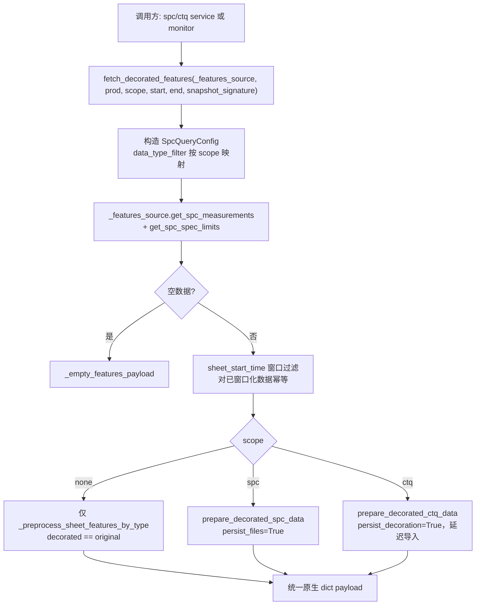

# APP 层共享修饰管线 decorated_features.py 解析

> 对应需求：`docs/dev_docs/dev_spec/Inline_domain/feat-decoration_unify.md` Task1.2
>
> 分析对象：`src/inline_domain/application/shared/decorated_features.py`

## 1. 定位

`decorated_features.py` 是 inline_domain **应用层唯一的共享"修饰 + 特征"计算入口**。
各子模块（spc / ctq / monitor）保留自己的 repository↔service 对，但"取数 → 按口径修饰 →
计算 Sheet 特征"这一段全部路由到本模块的 `fetch_decorated_features()`，使相同
（产品, 口径, 窗口）的请求跨模块命中同一条缓存。

模块 docstring（:1-11）明确了两个约束：

- 缓存边界遵循 ADR-0001：返回 dict 只含原生 DataFrame / dict / str / bool，
  不携带 dataclass 或自定义对象（保证 `st.cache_data` pickle 稳定）；
- 它是"single shared computation point"，复用的目的是**跨模块缓存命中**而不仅是代码复用。

## 2. 核心概念：scope（修饰口径）

```python
_DATA_TYPE_FILTER_BY_SCOPE = {
    "spc":  "SPC",   # 只取 SPC 类型参数
    "ctq":  "CTQ",   # 只取 CTQ 类型参数
    "none": "ALL",   # 不过滤，由调用方决定喂哪些行
}
```

scope 同时决定两件事（:33-41, :95-101）：

1. **取数过滤**：构造 `SpcQueryConfig` 时的 `data_type_filter`；
2. **修饰口径**：
   - `spc` → `resources/spc_sheet_oos_decoration.xlsx`（sheet = 产品名）；
   - `ctq` → `resources/ctq_sheet_oos_decoration.xlsx`（sheet 缺失 = 空修饰语义，由引擎处理）；
   - `none` → 完全跳过修饰，只做 preprocess 特征计算（与 aoi_tt 的免修饰口径一致）。

非法 scope 直接 `ValueError`（:113-114），不做静默兜底。

## 3. fetch_decorated_features() 执行流程



关键点：

- **缓存**：`@st.cache_data(show_spinner=False, max_entries=12, ttl=4h)`（:78）。
  缓存 key = (prod_code, scope, start_date, end_date, snapshot_signature)；
  `_features_source` 以下划线开头被排除在哈希之外（与既有 `_db_manager`/`_data_port`
  参数同一模式）。相同窗口跨模块共享一条缓存；不同窗口分开缓存（正确性优先）。
- **工作簿落盘时机**：spc/ctq 分支都以 `persist=True` 运行——**缓存 miss 时**修饰工作簿
  重写一次；缓存命中直接返回 payload，不重写工作簿（:102-105 注释）。
- **ctq 分支延迟导入**（:163-167）：`ctq` 包 `__init__` 依赖 `ctq_service`，
  而 `ctq_service` 依赖本模块，顶层导入会成环，因此在函数体内导入。
- **original 特征的来源不对称**（:161, :175-177）：spc 分支直接取
  `DecoratedSpcData.original_sheet_features_df`；ctq 分支因为包装函数不保留修饰前特征，
  在 shared 层用 `original_raw_measurements_df` 补算一次。这正好印证了文档
  《SPC 与 CTQ 数据修饰逻辑分析》第 5 节的结论——两个包装函数冗余，差异被 shared 层吸收。

返回 payload（:186-196）：

| 键 | 含义 |
|---|---|
| `sheet_features_df` | 修饰后 Sheet 特征（图表用） |
| `original_sheet_features_df` | 修饰前 Sheet 特征（真实/修正对比用） |
| `raw_measurements_df` | 修饰后点位 |
| `original_raw_measurements_df` | 修饰前点位 |
| `spec_empty` | 规格表是否为空（调用方据此降级空报表） |
| `sheet_oos_decoration` | `decoration_df / decoration_path / decoration_sheet` 或 None |

## 4. InMemoryFeaturesSource：monitor 的免重取数适配器

`InMemoryFeaturesSource`（:44-64）是一个 `SpcDataPort` 形状的内存适配器：

- monitor 已经按产品拉取了**全部** prepared measurements 并按 `data_type` 分组，
  如果让共享函数再经 repository 取数就是重复 IO；
- 适配器把单个分组（外加产品规格表）包装成 port 接口喂给 `fetch_decorated_features`，
  `get_spc_measurements()` 直接返回内存副本；
- 共享函数内部的窗口过滤对已窗口化数据是幂等的（:51-52 注释），不会错滤。

## 5. 消费方与缓存共享关系

| 消费方 | 调用方式 | scope |
|---|---|---|
| `spc_service.py:197` | 直接传 `_data_port` | `"spc"` |
| `ctq_service.py:97` | 直接传 `_data_port` | `"ctq"` |
| `monitor_service.py:95` | 按 data_type 分组，每组包一个 `InMemoryFeaturesSource` | 由 `_DECORATION_SCOPE_BY_DATA_TYPE` 映射：SPC→spc，CTQ→ctq，**AOI→none**，其余（UNKNOWN/NaN）兜底 spc（`monitor_service.py:58-68`） |

由此形成的契约：**SPC 报表、CTQ 报表、自动预警看板在窗口一致时读的是同一份修饰结果**，
三者看到的数据必然一致；修饰工作簿每个缓存 miss 只落盘一次。

## 6. 现状评价

- 该模块已经完成了"管线级"复用（取数/窗口/修饰路由/缓存），是本次统一需求里
  **做对的部分**，应作为 aoi 对齐的参照系；
- 但它路由的下层仍是 spc/ctq 两个近似复制的包装函数，且 `none` 口径是"完全免修饰"——
  aoi_tt/aoi_rs 的自动截断并未纳入此管线（aoi 数据不经过 Sheet 特征管线，见
  《修饰逻辑统一方案分析》第 3 节）；
- 统一两个包装函数后，本模块的 spc/ctq 双分支可简化为"按 scope 解析工作簿文件名的
  单分支"，ctq 延迟导入的循环依赖问题也随之消失。
