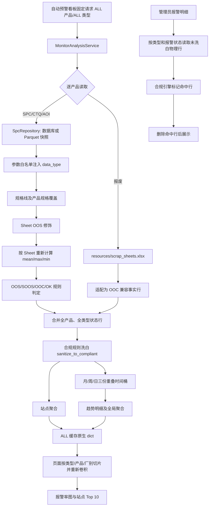

# 自动预警模块（monitor）数据修饰链路

## 1. 文档范围

本文基于当前代码说明自动预警看板从 SPC/CTQ/AOI/报废源数据到最终图表、Top 10 和管理员报警明细的实际数据链路，重点分析两类“修饰”：

- Sheet OOS 修饰：先对原始点位执行 Delete/裁剪/保留，再重新计算 Sheet 特征；
- 合规修饰：根据 1–5 段配置规则，把命中行的报警状态改写为 `OK`，并将报警计数归零。

本文描述的是当前实现，不把代码注释中尚未兑现的意图当作事实。主要入口为：

- `app/pages/自动预警看板.py`
- `app/manager/compliance_manager.py`
- `app/sections/monitor/monitor_dashboard.py`
- `src/inline_domain/application/monitor/monitor_service.py`
- `src/inline_domain/core/monitor/monitor_calculator.py`

## 2. 总体链路



核心结论：看板主图使用的是“先洗白、后聚合”的数据；管理员报警明细使用的是“先取真实报警行、再隐藏被洗白行”的数据。底层 Parquet 快照本身不会被合规修饰覆盖。

## 3. 数据进入 monitor 之前的修饰

### 3.1 时间窗口与 ALL 扫描

页面通过 `get_cached_query_window()` 固定查询窗口，结束时间默认为当前时间，起始时间为结束月份向前两个月后的月初，因此展示目标是最近三个自然月。页面始终以：

- `prod_code="ALL"`；
- `data_type_filter="ALL"`；
- `time_type="MIXED"`；
- `force_compliant=True`

调用 `get_monitor_dashboard_data()`。产品和监控类型切换不会重新读取后端，而是从同一份 ALL 缓存中切片。

ALL 产品通过扫描 `data/` 下的产品目录得到，并排除 `doc_cache`、`equipment`、`processed`、`raw`、`spc_cache`、`yield_cache` 等非产品目录。

### 3.2 SPC、CTQ、AOI 源数据

每个产品创建一个 `SpcRepository(data/<product>, use_snapshot=True)`：

1. 优先读取 `data/<product>/spc_snapshot_<product>.parquet`；快照过期、结构或策略签名过旧、显式强刷时，重新查询数据库。
2. 数据库失败或返回空时，已有快照可作为降级数据源。
3. 使用参数白名单过滤测量参数，并注入标准化后的 `data_type`：空值归为 `AOI`，其他值去空白后转大写，如 `spc` 归为 `SPC`。
4. 规格线来自数据库，并叠加产品 YAML 中按 `prod_code + step_id + param_name` 匹配的规格覆盖。

### 3.3 Sheet OOS 修饰

`prepare_decorated_spc_data()` 在合规洗白之前执行，是另一条独立的业务修饰链：

1. 按 `data_type` 隔离数据，避免不同监控类型互相聚合。
2. 点位级按 `factory + prod_code + sheet_id + step_id + param_name + site_name` 去重，保留时间最新记录。
3. 按 Sheet 粒度计算 `sheet_mean`、`sheet_max`、`sheet_min` 和最早 `sheet_start_time`，并绑定规格线。
4. 从原始测量值生成可审计的 Sheet OOS 明细/标记文件。
5. 按三态动作处理原始点位：`Delete` 删除匹配点位，`True` 裁剪 OOS 点，`False` 保留真实值。
6. 用修饰后的点位重新计算 Sheet 特征，monitor 只消费重新计算后的 `sheet_features_df`。

因此，自动预警的 OOS/SOOS/OOC 判定已经受 Sheet OOS 修饰影响；合规洗白并不是唯一会改变最终报警结果的机制。

### 3.4 状态判定

`apply_spc_rules()` 对每个 Sheet/站点/参数生成唯一状态，优先级固定为：

1. `OOS`：`sheet_mean` 超出 `USL/LSL`；
2. `SOOS`：`sheet_max/sheet_min` 超出 `USL/LSL`；AOI 不启用该规则；
3. `OOC`：`sheet_mean` 超出 `UCL/LCL`；
4. `OK`：均未命中。

随后生成 `is_oos`、`is_soos`、`is_ooc` 独热计数列，供后续聚合。

### 3.5 报废适配

报废数据来自 `resources/scrap_sheets.xlsx`，按产品过滤并标准化列名、日期和厂别。它不经过 SPC 特征计算，而是被适配为 monitor 可消费的兼容事实行：

- `data_type = "报废"`；
- `spc_status = "OOC"`；
- `is_ooc = 1`，其他报警标记为 0；
- `param_name/site_name = "报废"`。

页面层再把 OOC 文案解释为“报废片数/报废率”。

## 4. 合规配置的读取与规则模型

### 4.1 Excel 解析

`load_compliance_config_from_xlsx()` 优先用 `openpyxl` 读取全部 Sheet；企业加密工作簿读取失败时，通过共享 Excel COM 工具读取“规则配置”和“默认配置”。输出统一为：

```python
{
    "default": False,
    "rules": {
        "SPC-Z571-ARRAY-M04-W15": True,
    },
}
```

规则既可直接填写“规则键”，也可由“监控类型、产品型号、厂别、月份、周别”列拼接。月份和周别会标准化为 `Mxx`、`Wxx`，空维度视为 `ALL`，末尾连续的 `ALL` 会被裁掉。

### 4.2 规则含义

规则段顺序固定：

| 深度 | 格式 | 匹配维度 |
|---|---|---|
| 1 段 | `type` | 监控类型 |
| 2 段 | `type-prod` | 类型、产品 |
| 3 段 | `type-prod-factory` | 类型、产品、厂别 |
| 4 段 | `type-prod-factory-Mxx` | 再加自然月份 |
| 5 段 | `type-prod-factory-Mxx-Wxx` | 再加 ISO 周号 |

每段都支持 `ALL`。`True` 表示该范围启用洗白，`False` 表示该范围保留真实报警；未命中规则时使用 `default`。

`sanitize_to_compliant()` 按规则段数从少到多执行，因此更深规则覆盖较浅规则。同一深度没有“具体段数更多者优先”的独立排序，实际以 Excel 解析后字典的遍历顺序进行覆盖。

### 4.3 实际洗白动作

合规引擎先构造逐行布尔 mask。对命中且最终为启用的行：

- `is_ooc/is_oos/is_soos` 改为 `0` 或 `False`；
- `spc_status/status` 改为 `OK`；
- 已聚合数据中的 `OOS片数/OOC片数/SOOS片数` 改为 0；
- 已聚合数据中的 `OOS/OOC/SOOS` 比率改为 0.0；
- `add_tag=True` 时写入 `is_compliant_modified=True`。

原始测量值、Sheet 统计值和规格线不会被这一步修改。修饰是内存 DataFrame 变换，不回写数据库、Parquet 快照或报废 Excel。

## 5. 主看板中的修饰时点

### 5.1 合并前的条件洗白

当 `force_compliant=True` 时，每个产品、每个监控类型的状态表在加入 `all_status_dfs` 前会调用一次 `sanitize_to_compliant()`；报废分支也相同。

### 5.2 合并后的无条件洗白

所有产品和类型合并为 `raw_status_df` 后，服务无条件再次执行：

```python
raw_status_df = sanitize_to_compliant(raw_status_df, add_tag=True)
```

这意味着当前 `fetch_dashboard_data_dict()` 中，`force_compliant=False` 也无法关闭主看板合规修饰；该参数只决定是否在合并前额外执行一次。自动预警页面传入 `True`，所以命中行通常经历两次幂等洗白。

### 5.3 洗白后聚合

洗白后的 `raw_status_df` 先按最近三个自然月裁边，再分成两路：

- 站点路：在数据扩充前，按 `prod_code + factory + step_id + data_type` 聚合；只保留报警片数大于 0 的站点，用于 Top 10。
- 趋势路：同一物理行分别进入月、周、日三个重叠时间桶，再生成：
  - `global_summary_df`：按时间桶汇总；
  - `detail_df`：按时间桶、产品、厂别、类型汇总。

聚合的抽检数使用 `sheet_id + step_id + param_name` 唯一组合，报警率为相应报警片数除以抽检数。`is_compliant_modified` 通过 `max` 传播到聚合桶，但页面的二次卷积只汇总计数列，不继续展示该标签。

### 5.4 缓存与页面联动

重负载结果由 `fetch_dashboard_data_dict()` 的 `st.cache_data(max_entries=1)` 缓存为原生字典，再在缓存外组装 `MonitorDashboardViewModel`。缓存键包含查询 JSON、时间类型、`force_compliant`、类型过滤和签名参数，但自动预警页面传入的是固定字符串 `auto_warning_dashboard_manual_clear_v1`，不是快照或合规文件的实时内容签名。

页面从 ALL 缓存中按监控类型、产品和厂别过滤，随后按绝对片数重新卷积并计算报警率。因此页面筛选只改变已洗白结果的展示范围，不会重新执行合规规则。

## 6. 报警明细的修饰链路

当前页面只为管理员渲染“报警明细表”。其链路与主图不同：

1. 对 SPC、CTQ、AOI、报废分别查询 OOC 和 OOS 明细。
2. 调用 `get_monitor_defect_details(..., force_compliant=False)`，先保留真实报警状态。
3. `_apply_compliance_visibility_filter()` 再调用统一合规引擎并加 `is_compliant_modified` 标签。
4. 删除标签为 True 的行，只展示未被合规规则命中的真实报警行。
5. 最终按页面所选产品、厂别和报警状态过滤。

这里的合规文件签名被加入管理员明细缓存键，因此目标配置文件变化会使该缓存失效。旧的弹窗下钻链路则先用 `compliance_manager.get_compliance_config()` 计算一个整体 `force_compliant` 布尔值，再决定是否洗白，规则口径与逐行可见性过滤不同。

## 7. `compliance_manager.py` 的职责

该模块主要承担配置管理 UI，而不是主看板洗白计算：

- 保证管理配置文件存在，支持旧 YAML 迁移；
- 加载、保存、下载和上传配置；
- 为给定类型/产品/厂别/月/周计算单个布尔状态；
- 向管理员展示当前选择组合；
- 同一面板还附带报废 Sheet 上传与相关缓存清理。

`get_compliance_config()` 的优先级为：规则深度更大优先；同深度下具体非 `ALL` 段更多优先；仍相同时后出现规则优先。这与 `sanitize_to_compliant()` 的“只按深度排序、同深度按原顺序覆盖”并不完全相同。

## 8. 当前实现中的断点与口径风险

### 8.1 管理配置与运行配置路径分叉

这是当前最重要的链路断点：

| 消费方 | 实际路径 |
|---|---|
| `app/manager/compliance_manager.py` | 相对当前工作目录的 `config/compliance_config.xlsx` |
| `ConfigLoader.get_compliance_config()` / `sanitize_to_compliant()` | 项目根目录下的 `resources/compliance_config.xlsx` |

检查时仓库只有 `resources/compliance_config.xlsx`，没有 `config/compliance_config.xlsx` 或旧 YAML。运行管理员面板时，`_ensure_config_exists()` 会在 `config/` 新建一个默认禁用文件；管理员看到、下载和上传的是这个新文件，但主看板洗白仍读取 `resources/` 下的文件。

结果是：管理员面板显示的状态和上传的修改可能不影响看板；报警明细缓存签名也跟踪 `config/` 文件，而逐行可见性过滤实际读取 `resources/` 文件。

### 8.2 `force_compliant` 不能关闭主看板洗白

服务在合并后无条件洗白，使参数名和调用方语义不一致。主图、站点 Top 10 永远服从运行配置；传 `False` 只会少一次合并前洗白。

### 8.3 主图、旧弹窗和管理员明细的规则求值方式不同

- 主图：逐物理行读取日期并匹配 1–5 段规则；
- 管理员明细：同样逐行匹配，然后隐藏命中行；
- 旧弹窗：先在没有 month/week 参数的情况下求一个组合级布尔值，再决定是否调用逐行引擎，4/5 段时间规则可能无法触发该入口。

因此同一报警可能在图表中已被洗白，却仍能从旧弹窗链路看到。

### 8.4 管理面板的状态展示不是级联求值

面板表格直接执行 `config["rules"].get("type-prod-factory", default)`，没有调用 `get_compliance_config()`。1/2 段规则、`ALL` 通配及 4/5 段规则均可能导致展示值与实际求值不同。

### 8.5 缓存失效来源不统一

- 主看板使用固定页面签名，合规文件变化后需要用户刷新/清缓存才能可靠重算；
- 管理员明细把 `config/` 文件签名加入缓存键；
- 实际合规引擎读取 `resources/` 文件。

三个边界没有围绕同一个生效文件建立统一签名。

### 8.6 诊断日志名称可能误导

主服务在洗白后才记录“原始物理 OOC 总数”，该数字实际已经是合规修饰后的数量，不是原始物理报警数。

## 9. 当前配置快照观察

本次分析时：

- `resources/compliance_config.xlsx` 存在，且需要 Excel COM 回退读取；
- 解析结果为 `default=False`、10 条规则；
- 其中 9 条为 4 段规则、1 条为 5 段规则，且全部启用；
- `config/compliance_config.xlsx` 与 `config/compliance_config.yaml` 均不存在。

这些数字是生成本文时的运行配置快照，不是稳定业务规则；稳定规则仍应以实际生效工作簿为准。

## 10. 可验证的关键契约

现有测试覆盖以下事实：

- Sheet OOS 修饰后的特征会被自动预警服务消费；
- Excel 规则可以从显式规则键或分列字段还原；
- `ALL` 通配、深度优先和同深度具体性优先由 `compliance_manager.get_compliance_config()` 验证；
- ALL 类型缓存可在页面切换 SPC/CTQ/报废并按片数重新卷积；
- 管理员明细会隐藏被合规引擎标记为修饰的物理报警行。

当前测试没有锁定以下风险行为：配置路径分叉、主看板无条件洗白、同深度规则在管理器与向量化引擎中的优先级差异，以及主缓存对实际生效合规文件的失效行为。

