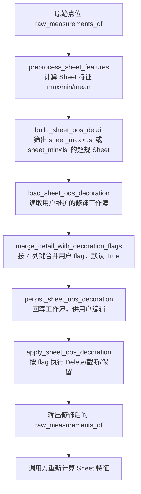

# SPC 与 CTQ 数据修饰逻辑分析

> 对应需求：`docs/dev_docs/dev_spec/Inline_domain/feat-decoration_unify.md` Task1.1
>
> 本文基于当前代码实现，说明 SPC 与 CTQ 两个子模块的数据修饰逻辑，分析二者设计是否一致、能否统一。

> **状态更新（2026-08-14）**：本文第 5 节的统一结论已实施——两个应用层 wrapper 已合并为
> `application/shared/decorated_data.py::prepare_decorated_data(scope=...)` 并删除原文件，
> 引擎已迁入 `core/shared/sheet_oos_decoration.py`。第 2~4 节保留统一前的事实记录，
> 其中 `core/spc/spc_sheet_oos_decoration.py` 与两个 wrapper 的路径描述已成为历史。

## 1. 总体结论

**SPC 与 CTQ 的 Sheet OOS 修饰在设计上是完全一致的**：两者调用同一个核心引擎
`prepare_sheet_oos_decoration()`（`src/inline_domain/core/spc/spc_sheet_oos_decoration.py:338`），
共享同一套三态 flag 语义、同一套截断算法、同一个资源配置目录和同一个 clip_rules 配置。
二者的差异只有两类：

1. **修饰工作簿文件名不同**（`spc_sheet_oos_decoration.xlsx` vs `ctq_sheet_oos_decoration.xlsx`），
   这只是引擎的一个参数；
2. **SPC 多出独有逻辑**：返回值中保留修饰前特征（历史用途是真实/修正 CPK 对比，
   该双轨逻辑已移除，修饰前特征目前仅随管线透传）和第二层 CPK 修饰，
   这是 SPC 有 CPM/CPK 周期能力报表而 CTQ 没有的业务差异，不属于修饰算法本身的分歧。

因此：**二者可以统一**，详见本文第 5 节与《修饰逻辑统一方案分析》（`decoration-unify-proposal.md`）。

## 2. 共享核心引擎：spc_sheet_oos_decoration.py

文件：`src/inline_domain/core/spc/spc_sheet_oos_decoration.py`

### 2.1 处理流程

### 2.2 三态 flag 语义（核心契约）

修饰工作簿每行是一个超规 Sheet，键为
`OOS_KEY_COLUMNS = [prod_code, step_id, param_name, sheet_id]`（`spc_sheet_oos_decoration.py:19`），
`flag` 列支持三种取值：

| flag 取值 | 语义 | 实现 |
|---|---|---|
| `Delete` | 从图表中删除该 Sheet 的所有点位 | `_exclude_delete_flagged_measurements()`（:245）按键反连接剔除 |
| `True`（默认） | 截断：越规点改写为线内伪随机值 | `_clip_inside_spec()`（:102） |
| `False` | 释放：保留真实值，不修饰 | `_parse_flag()`（:77），空值/无法识别默认 True |

flag 归一化入口是 `_normalize_flag_action()`（:92）：先判 Delete，再按布尔解析。

### 2.3 截断算法

`_clip_inside_spec()`（:102-125）：

- 上限越规 → 截断到 `usl - (0.05 + fraction*0.1) * span`，即线内 5%~15% span 处；下限对称处理；
- 需要双边规格（`usl <= lsl` 或任一缺失时不修饰，见 :106）；
- `fraction` 由 `_stable_fraction()`（:96）对
  `prod_code|step_id|param_name|sheet_id|site_name|unit_id|value|side` 做 SHA-256 得到，
  同一数据行重跑结果一致（报表可复现）。

### 2.4 参数级规格偏移（clip_rules）

`_apply_clip_rules()`（:128）按 `config/spc_config.yaml` 的
`spc.sheet_oos_decoration.param_clip_rules` 对匹配参数（`param_name_contains`）的
usl/lsl 施加偏移，用于修饰口径而不改动上游官方规格列。
SPC 与 CTQ 都通过 `ConfigLoader.get_spc_sheet_oos_clip_rules()` 读取同一份规则。

### 2.5 工作簿机制

- 工作簿位于 `resources/` 根目录，**每个产品一个 sheet**（sheet 名 = `prod_code`）；
- 读取兼容企业加密文件：openpyxl 失败时回退 Excel COM（`_read_encrypted_xlsx_via_com`，:205）；
- 回写用 `replace_workbook_sheet()` 替换指定 sheet，不影响其他产品；
- 每次运行以当前超规明细为基准刷新工作簿，已有用户 flag 按键保留
  （`merge_detail_with_decoration_flags()`，:226）。

**这个工作簿就是需求中"提供配置文件，可以指定 sheet 释放或删除"的既有实现**：用户在工作簿中
把某行 flag 改为 `False` 即释放真实值，改为 `Delete` 即删除该 Sheet。

## 3. SPC 侧的包装：spc_data_decoration.py

文件：`src/inline_domain/application/spc/spc_data_decoration.py`

`prepare_decorated_spc_data()`（:59）在核心引擎之上做三件事：

1. **data_type 隔离的特征计算**：`_preprocess_sheet_features_by_type()`（:40）按 `data_type`
   分组分别调用 `preprocess_sheet_features()` 再 concat，保持自动预警服务既有的类型隔离契约；
2. 调用 `prepare_sheet_oos_decoration()`，使用默认文件名 `spc_sheet_oos_decoration.xlsx`；
3. 用修饰后的点位**重新计算 Sheet 特征**，并同时返回修饰前特征
   （`DecoratedSpcData.original_sheet_features_df`，:25）。
   注意：自本次需求修正后，**CPK 仅基于修饰后的点位/特征计算**，
   修饰前特征不再参与 CPK 真实/修正对比（该双轨逻辑已移除）。

此外 SPC 还有**第二层修饰 —— CPK 修饰**（`src/inline_domain/core/spc/cpk_decoration.py`）：

- 作用于周期能力值（M/W/D 的 cpk），而非原始点位；CPK 由修饰后的点位数据计算；
- 工作簿为 `spc_cpk_decoration.xlsx`，键含 `period_type/period_label`，
  `cpk_corrected` 列默认填计算值，用户可手工改写；
- flag 语义为 opt-in：空值默认 `False`（显示计算值），
  用户显式置 True 才用修饰表中的 `cpk_corrected` 覆盖（`cpk_decoration.py:75-80` 注释）。

## 4. CTQ 侧的包装：ctq_data_decoration.py

文件：`src/inline_domain/application/ctq/ctq_data_decoration.py`

`prepare_decorated_ctq_data()`（:58）与 SPC 版几乎逐行对应，差异仅有：

| 维度 | SPC | CTQ |
|---|---|---|
| 工作簿文件名 | `spc_sheet_oos_decoration.xlsx`（引擎默认值） | `ctq_sheet_oos_decoration.xlsx`（通过 `decoration_file_name` 参数传入，:77） |
| 持久化开关参数名 | `persist_files` | `persist_decoration` |
| 修饰前特征 | 由引擎调用方显式计算并保留在返回值中 | 不保留（CTQ 无真实/修正对比需求） |
| 第二层修饰 | CPK 修饰（`spc_cpk_decoration.xlsx`） | 无（CTQ 没有能力报表） |
| 资源目录解析函数 | `resolve_product_resource_dir()` | `resolve_ctq_product_resource_dir()`，实现完全相同 |
| `_preprocess_sheet_features_by_type` | 定义在 spc 侧，被 shared 复用 | 在 ctq 侧重复定义了一份（:41-55），逻辑相同 |

两个包装函数的算法路径（特征计算 → 引擎 → 重算特征）完全一致，
**重复度约 90%，是典型的复制粘贴**。

## 5. 一致性判定与可统一性分析

### 5.1 设计是否一致？—— 是

判定依据：

- 同一个核心引擎、同一个三态 flag 契约、同一个截断算法、同一个 clip_rules 配置来源；
- 同样的"先算特征定位超规 Sheet → 用户工作簿决策 → 修饰点位 → 重算特征"管线形状；
- 同样的资源布局（`resources/` 根目录、每产品一个 sheet、企业加密回退）。

### 5.2 能否统一？—— 能

两个包装函数的全部差异都可以参数化：

- 文件名差异 → 一个 `scope`/`file_name` 参数（引擎本身已支持 `decoration_file_name` 参数，
  `spc_sheet_oos_decoration.py:344`）；
- `persist_files`/`persist_decoration` 参数名差异 → 统一命名即可；
- "是否保留修饰前特征" → 自 CPK 双轨逻辑移除后，修饰前特征已无消费方，
  统一时可选择直接下线（少一次特征重算），或暂时保留为返回 dataclass 的可选字段；
- CPK 修饰是 SPC 在 Sheet OOS 修饰**之后**的独立第二层（单轨：仅基于修饰后数据计算，
  用户可按周期覆盖），不影响 Sheet OOS 修饰的统一，继续留在 `core/spc/` 即可。

SPC 额外保留修饰前特征曾是"真实 CPK vs 修正 CPK"对比的需要；该对比逻辑移除后
这一差异已消失，不再构成统一的障碍。

### 5.3 佐证

`src/inline_domain/application/shared/decorated_features.py` 已经把 SPC/CTQ 当作同一管线的
两个分支来路由（`scope="spc"` / `scope="ctq"`，:154-177），两个分支的区别仅在于调用哪个
包装函数——这正是"二者本就是一个算法"的直接证据。统一后的自然形态是让 shared 管线
按 scope 解析工作簿文件名后直接调用引擎，两个包装函数随之消亡。
