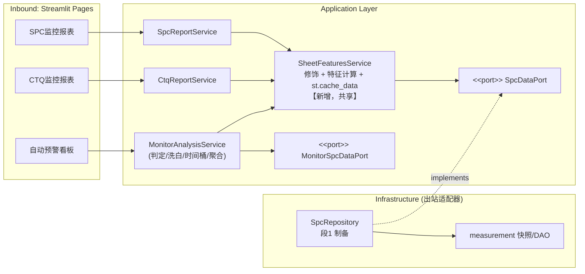

# Monitor 数据链优化：复用评估与六边形架构设计（V2）

- 日期：2026-08-13（V2 修订，对齐 ADR-0012 落地后的代码现状）
- 范围：`src/inline_domain/{application,infrastructure}`、`src/inline_domain/composition.py`
- 关联：`docs/ADR/0012-shared-inline-measurement-snapshot.md`
- 触发需求：监控报表的数据来自 SPC/CTQ 模块，monitor 不应重复提取数据；并评估
  "取数 + 白名单过滤 + data_type 注入 + Sheet OOS 修饰 + Sheet 特征计算"
  这条公共管路的归属层级（monitor 模块？repository 层？）

---

## 1. 现状（infrastructure 重构落地后）

### 1.1 已完成的分层（ADR-0012）

```text
application/
  ports/measurement_snapshot.py     # MeasurementSnapshotPort / MetadataPort / MainProcessHistoryPort
  spc/ports.py                      # SpcDataPort（消费方拥有的 Protocol）
  spc/dtos.py                       # SpcQueryConfig
  ctq/ports.py                      # CtqDataPort(SpcDataPort)
  monitor/ports.py                  # MonitorSpcDataPort(SpcDataPort + get_scrap_data) + 工厂类型
infrastructure/
  measurement/                      # 共享 DAO + 产品级原始 Parquet 快照（一次提取，三报表复用）
  spc/repositories/spc_repository.py  # SPC 派生制备（见 1.2）
  ctq/ctq_repository.py             # 固定 data_type_filter="CTQ" 的投影门面
  monitor/monitor_repository.py     # 自动预警用例仓储门面
composition.py                      # 组合根：页面边界装配端口实现
```

### 1.2 公共管路各阶段的当前位置

| 管路阶段 | 当前位置 | 状态 |
|---|---|---|
| 取数（三厂 UNION + 产品/时间下推） | `infrastructure/measurement/measurement_data_loader.py` + 快照仓储 | ✅ 已共享，只提取一次 |
| 白名单过滤 + data_type 注入 | `SpcRepository._prepare_shared_measurements`（`spc_repository.py:166-201`） | ✅ 已沉入 repository |
| 异常点过滤 + 主制程追溯 | 同上（`:202-223`） | ✅ 已沉入 repository |
| Sheet OOS 修饰 | `application/spc/spc_data_decoration.py`、`application/ctq/ctq_data_decoration.py` | ⚠️ 三处各自执行 |
| Sheet 特征计算 | `core/monitor/monitor_calculator.preprocess_sheet_features`（被修饰模块调用） | ⚠️ 随修饰重复执行 |
| 规则判定/洗白/时间桶/聚合 | `application/monitor/monitor_service.py` | monitor 专属，正确归属 |

### 1.3 仍存在的重复

1. **修饰 + 特征计算重复 3 次**：spc、ctq、monitor 各自调用 `prepare_decorated_*` +
   `preprocess_sheet_features`（修饰还伴随 `resources/` 下审计文件的读写）。
2. **口径不一致**：monitor 对 CTQ 数据仍走 SPC 口径修饰（`monitor_service.py:21` 引入的是
   `prepare_decorated_spc_data`），ctq 模块用 `resources/<prod>/ctq/` 口径——两者产出不同。
3. **monitor 缓存粒度过粗**：`fetch_dashboard_data_dict` 的 `st.cache_data` 把
   "修饰→判定→聚合"整条链包在一个缓存里，无法与 spc/ctq 共享中间产物。

---

## 2. 归属评估：公共管路应该放哪？

### 2.1 结论先行

把管路拆成**两段**，归属不同：

| 管路段 | 归属 | 结论 |
|---|---|---|
| 段 1：取数 + 白名单 + data_type 注入（+ 异常点/追溯） | **repository 层（infrastructure）** | ✅ 正确，且已落地 |
| 段 2：Sheet OOS 修饰 + Sheet 特征计算 | **application 层共享服务**（不是 monitor 模块，也不是 repository 层） | 见 2.3 论证 |

monitor 模块两段都不放——monitor 只是三个消费方之一，公共管路放进 monitor 会让
spc/ctq 反向依赖 monitor，依赖方向错乱。

### 2.2 段 1 放 repository 层 —— 正确

段 1 的职责是"**从持久化装配领域就绪的事实集**"：SQL、Parquet 快照、TTL、失败降级、
白名单表 merge。这些全是出站适配器职责，与存储技术紧耦合，且所有消费方口径完全一致。
ADR-0012 的 Alternatives 已正确否决了"放入 application service"（会造成依赖方向反转）。
你的重构方向是对的。

### 2.3 段 2 不应放 repository 层

1. **修饰是业务规则，不是取数**。三态 flag（Delete/裁剪/保留）、合规裁剪策略来自
   可配置工作簿，是 domain policy；repository 的契约应是"提供事实"，不该承载
   "按某报表口径加工事实"的语义。
2. **消费方口径天然分叉**：spc 同时需要修饰前特征（真实能力值）与修饰后特征（展示）；
   ctq 用独立修饰目录；monitor 需要全类型。把分叉塞进 repository 会让
   `get_spc_measurements` 的契约不断膨胀，repository 变成上帝对象。
3. **特征计算是纯领域函数**：`preprocess_sheet_features` 在 `core/` 层、零 I/O。
   让 repository 输出派生分析结果，会把 core 的演进拖进 infrastructure 的修改半径。
4. **共享缓存是 delivery 关注点**：`st.cache_data` 属于 Streamlit 交付框架，
   放进 infrastructure 会让出站适配器依赖 Web 框架，破坏可测试性
   （当前 application 服务已能用 fake ports 单测，正是 ADR-0012 的收益）。

### 2.4 段 2 的正确位置：application 层共享服务

段 2 是"编排 domain 规则"的用例逻辑，典型 application 层职责。三模块共享它，
通过一个**应用层共享服务**承载（即本文 V1 方案的 `SheetFeaturesProvider`，保留），
它**向下只依赖 `SpcDataPort`**（application → port ← infrastructure adapter），
依赖方向始终向内，与 ADR-0012 完全兼容。

---

## 3. 目标设计（在 ADR-0012 基础上的增量）

### 3.1 架构图



### 3.2 新增模块（唯一新增）

```text
src/inline_domain/application/shared/
  __init__.py
  sheet_features_service.py   # SheetFeaturesService
```

```python
@dataclass(frozen=True)
class SheetFeaturesQuery:
    prod_code: str
    data_type_filter: str        # 'SPC' | 'CTQ' | 'ALL'（AOI 随 ALL 覆盖）
    decoration_scope: str        # 'spc' | 'ctq' → 修饰目录口径（决策点 D2）
    snapshot_signature: str = "" # 参与缓存 key，支撑强刷失效

class SheetFeaturesService:
    """段 2 的唯一执行点：经 SpcDataPort 取制备后测量 → 修饰 → 特征计算。"""

    def __init__(self, data_port_factory: Callable[[str], SpcDataPort]): ...

    @staticmethod
    @st.cache_data(show_spinner=False, max_entries=8, ttl=4 * 60 * 60)
    def fetch_features(_data_port_factory, query_json: str) -> dict:
        """缓存 key = (prod, data_type, decoration_scope, signature)；
        时间窗口不进 key（repository 已输出 3 个月滚动窗口），消费方自行切片。"""
```

要点：

- 方法名**不带下划线前缀**，保持 `extract_cached_funcs` 强刷联动可抓取；
  三个页面的 `funcs_to_clear` 需登记它（见 4.3）。
- 只返回原生 dict/DataFrame，ViewModel 在缓存边界外组装（延续现有约定）。
- 内部按 `decoration_scope` 分派到现有 `prepare_decorated_spc_data` /
  `prepare_decorated_ctq_data`——**段 2 逻辑不平移、不改行为，只收敛调用点**。

### 3.3 monitor 重构后的形态

`fetch_dashboard_data_dict` 变为薄判定层：

1. 经 `SheetFeaturesService` 取 `ALL` 特征（命中时零计算）；
2. 经 `MonitorSpcDataPort.get_scrap_data` 取报废数据（monitor 专属分支，不变）；
3. `apply_spc_rules → sanitize_to_compliant → 站点聚合 → 时间桶 → 全局/明细聚合`（不变）。

`get_monitor_defect_details` 同样改走共享服务，删除其内联的取数/修饰副本
（当前它与主流程各抄一遍，顺带收敛）。

---

## 4. 迁移计划（更新）

已完成（ADR-0012）：段 1 沉入 repository、ports/composition 落地、页面注入工厂。

待办：

1. **特征化测试**：固定 prod + 结束日期，对 monitor 三输出 DF 与 spc/ctq payload 做快照断言。
2. **建 `application/shared/sheet_features_service.py`**：收敛段 2，挂缓存。
3. **切 spc / ctq**：两个 Service 改经共享服务取特征，验证页面输出不变。
4. **切 monitor**：替换 `fetch_dashboard_data_dict` 与 `get_monitor_defect_details` 的
   修饰段；monitor 自身薄缓存保留。
5. **页面登记清缓存**：`app/pages/自动预警看板.py:72` 及 SPC/CTQ 页面的
   `funcs_to_clear` 增加 `SheetFeaturesService.fetch_features`。
6. 保留 `INLINE_USE_SHARED_FEATURES` 开关，单步可回滚。

### 4.1 风险与对策

| 风险 | 对策 |
|---|---|
| 强刷链路断裂 | 页面登记共享服务缓存函数 + `snapshot_signature` 参与缓存 key，双保险 |
| 内存膨胀 | `max_entries=8`（产品数 × 口径数估算）+ TTL 兜底 |
| CTQ 口径切换改变 monitor 数字 | 决策点 D2 确认后切换，特征化测试出 diff 报告 |

### 4.2 待确认决策点

- **D2（CTQ 修饰口径，关键）**：monitor 的 CTQ 数据是否切换到 `resources/<prod>/ctq/`
  口径？切换 = 与 ctq 模块严格一致（推荐，正是一致性目标）；不切换 = 维持现状，
  一致性仅部分达成。
- **D3（AOI 归属）**：monitor 的 AOI 数据随 `ALL` 经共享服务同源（当前架构下自然成立），
  无需独立处理；aoi_tt/aoi_rs 报表不在本次范围。
- ~~D1（窗口归属）~~：已被 ADR-0012 消解——repository 固定输出 3 个月滚动窗口，
  共享服务缓存不含时间维度，消费方自行切片。

---

## 5. 总结

- **段 1（取数+白名单+data_type 注入）放 repository 层：正确**，你的重构已落地，
  "数据只提取一次"在快照 + 制备层已达成。
- **段 2（修饰+特征计算）不放 repository，也不放 monitor**：它是应用层用例逻辑，
  正确位置是 `application/shared` 的共享服务，向下只依赖 `SpcDataPort`。
- 完成 4.1-4.6 后，三模块实现**同源（段 1，repository）+ 同源（段 2，共享服务）**，
  重复计算仅剩 monitor 专属的判定/聚合薄层——这是它不可共享的领域职责。
