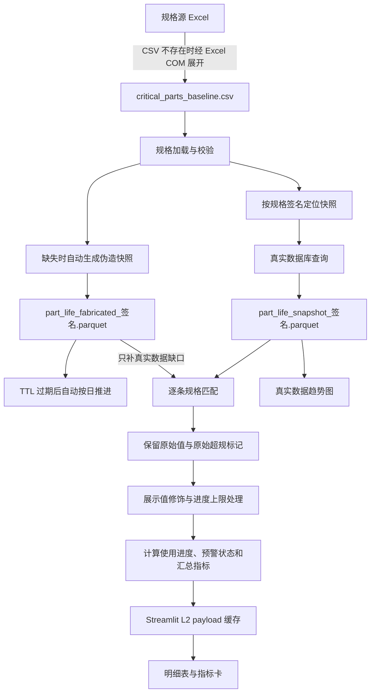

# 关键备件模块数据处理机制

## 1. 文档范围

本文说明 `src/equipment_domain` 及其页面、运维脚本所组成的关键备件数据链路，重点描述以下机制：

- 规格基线如何取得和标准化；
- 真实数据如何从数据库抓取并形成快照；
- 伪造数据如何首次生成、后续推进；
- 页面上的“刷新数据”和“刷新缓存”分别做什么；
- 真实值与伪造值如何匹配、修饰并形成最终报表；
- 明细报表与趋势图的数据来源差异。

本文描述当前代码的实际行为，不展开正则匹配和数值修饰的详细算法。

## 2. 总体数据流

核心原则是：**规格基线决定监控项，真实快照优先，独立伪造快照只补真实匹配缺口；报表进入快照层时自动维护伪造数据。**

## 3. 参与对象与存储位置

| 对象 | 当前来源/位置 | 作用 |
|---|---|---|
| 规格基线 | `resources/critical_parts_baseline.csv` | 定义每条监控规格、站点、机台/腔室、参数模式和寿命规格 |
| 规格原始 Excel | 配置项 `baseline.source_excel_path` | CSV 缺失时的回退来源 |
| 真实快照 | `data/equipment/part_life_snapshot_<signature>.parquet` | 保存数据库查询结果 |
| 伪造快照 | `data/equipment/part_life_fabricated_<signature>.parquet` | 只为没有真实匹配的规格提供当前值 |
| 页面 L2 缓存 | Streamlit `st.cache_data` | 缓存最终 DataFrame 和汇总标量 |
| 运行策略 | `config/equipment_config.yaml` | 控制查询窗口、TTL、阈值和伪造推进规则 |

`<signature>` 是对完整规格 DataFrame（含行顺序和索引）计算的 12 位内容签名。真实与伪造快照使用同一签名，但文件名前缀不同，因此互不覆盖。规格内容或顺序变化后，会自然定位到一组新的快照文件。

## 4. 规格基线的取得与预处理

### 4.1 常规路径

1. 页面和应用服务传入 `resources/critical_parts_baseline.csv`。
2. 加载器按配置编码读取 CSV，要求存在以下九列：厂别、备件类型、设备类型、膜层、制程、寿命规格、站点、机台号-腔室、参数名称。
3. `寿命规格` 去掉非数字/小数字符后转为数值；无法转换的值保留为空。
4. 删除整行均为空的记录并重建索引。

当前仓库基线共有 1,781 行。基线既是报表行集合，也是数据库查询条件、快照签名、伪造数据键和寿命计算的共同依据。

### 4.2 CSV 缺失时的回退路径

若目标 CSV 不存在，加载器才会读取配置指定的原始 Excel：

1. 通过 Windows Excel COM 打开工作簿，因此该回退依赖本机 Excel 和 `pywin32`。
2. 只读取配置列出的 Sheet，并校验 Sheet 是否存在、是否有数据行。
3. 从第二行开始读取；一个单元格内用换行分隔的多个站点、多个机台分别拆开。
4. 对站点和机台做笛卡尔展开，每个输出单元格只保留一个值。
5. 合并所有配置 Sheet，写成标准九列 CSV，随后进入常规加载流程。

这是一种“缺文件时重建基线”的机制，不是每次页面访问都重新解析 Excel。

## 5. 真实数据抓取机制

### 5.1 查询条件的形成

真实数据查询来自配置的 `query.source_table`，当前为 `eda.ARRAY_PDS_RESULT_T`。查询步骤如下：

1. 从基线提取所有去重的站点和机台/腔室。
2. 从非空的“参数名称”提取 SQL `LIKE` 模式。
3. 使用参数化 `IN` 和 `LIKE` 条件查询 `step_id`、`sub_equip_id`、`param_name`、`value`、`glass_start_time`。
4. 仅查询配置回溯窗口内的数据，当前为最近 90 天。
5. 查询结果按测量时间倒序；加载后将列名转为小写、测量值转为数值、测量时间转为时间类型，并丢弃无效测量值。

站点列表和机台列表分别形成 `IN` 条件，最终逐规格匹配时才重新执行“站点 + 机台 + 参数”的完整约束。

### 5.2 真实快照缓存

普通报表读取时，真实数据采用 L1 Parquet 快照：

1. 根据规格签名定位 `part_life_snapshot_<signature>.parquet`。
2. 文件存在且修改时间未超过真实快照 TTL 时直接读取；当前 TTL 为 8 小时。
3. 文件不存在或过期时重新查询数据库。
4. 查询有结果才写入/覆盖真实快照；空结果不会覆盖已有文件。
5. 数据库引擎不可用或查询异常时，本次返回空 DataFrame。当前实现不会在该次调用中回读已经过期的旧快照。

因此，“数据库失败时保留磁盘旧文件”和“本次报表继续使用旧文件”是两件事：前者成立，后者不成立。若页面 L2 缓存仍有效，用户仍可能看到上一次缓存视图；一旦重新计算，则真实源为空并由伪造补缺机制接管可匹配项。

## 6. 伪造数据机制

伪造数据与真实数据使用相同的五列快照结构：`step_id`、`sub_equip_id`、`param_name`、`value`、`glass_start_time`，但保存为独立文件。

### 6.1 首次生成

首次读取发现当前规格签名没有伪造快照时会自动生成。机制如下：

1. 加载并校验规格基线。
2. 只处理寿命规格大于 0、站点非空、机台/腔室非空的可监控规格。
3. 为每个唯一的“站点 + 机台/腔室 + 已解析参数名”生成一条当前值；重复规格键只保留一条，若同一键对应不同寿命规格则报错。
4. 非空参数模式被物化为一个满足现有 `LIKE` 规则的参数名。
5. 空参数规格生成带 `__FABRICATED_PART__` 前缀的稳定内部键。该键由规格身份字段归一化后哈希得到，用于精确回配，不在前端展示。
6. 初始测量值按配置落在寿命规格的某个比例范围内，当前为 0%～100%；测量时间独立落在基准时刻前 2 天内。
7. 初始比例和时间由规格键、配置种子稳定映射；相同规格和基准时间结果可复现，不使用运行时随机抽样。
8. 自动生成通过临时 Parquet 原子替换到目标路径，避免读取半写入文件；手工生成命令仍默认拒绝覆盖已有文件。

### 6.2 后续更新

页面载荷重新进入快照层时会检查伪造快照 TTL，并自动完成以下维护：

1. 通过当前规格签名定位伪造快照；文件不存在时执行首次生成。
2. 用文件修改时间计算年龄。小于伪造 TTL（当前 24 小时）时跳过更新。
3. 若已经跨过多个完整 TTL 周期，则一次补齐对应数量的日推进；手工命令的 `--force` 仍只推进一次。
4. 更新前校验五个必需列、非空数据、唯一键、合法数值/时间，以及每个快照键仍能映射回当前规格。
5. 每个周期将测量时间推进 1 天；测量值以配置的 30% 为中心，叠加由业务键和目标日期决定的小幅确定性变化，形成连续的近似等差序列。
6. 达到寿命规格时执行周期回绕，溢出量成为更换后新备件的起点，并受配置的 0%～30% 重置区间约束。
7. 更新保持原有键集合和行数，并通过原子替换写回同一伪造快照文件。

文件 `mtime` 是 24 小时资格判断依据。复制、恢复或人工改动文件时间会影响是否更新。

### 6.3 与页面读取的边界

页面通过应用服务自动维护并读取伪造快照：

- 缺失时自动生成；
- 结构缺列时直接报错；
- 应用层缓存每小时重新进入一次快照层，快照层再按 24 小时 TTL 判断是否推进；
- 页面上的手工刷新会清理应用层缓存，因此也会立即触发一次 TTL 检查，但有效快照不会重复推进。

## 7. 真实优先、伪造补缺的匹配机制

应用服务同时加载真实快照和伪造快照，然后对基线的每一条规格独立处理：

1. 分别按 `(step_id, sub_equip_id)` 为两个来源建立索引。
2. 先在真实索引中匹配相同站点和机台/腔室。
3. 参数名称非空时按 SQL `LIKE` 等价语义匹配；参数名称为空时按稳定内部伪造键精确匹配。
4. 同一来源命中多条时，选择 `glass_start_time` 最新的一条；时间均无效时取第一条。
5. 只有真实来源完全没有匹配记录时，才对该规格查询伪造索引。
6. 两个来源都未命中时仍保留规格行，只让测量值、测量时间和匹配参数名为空。

两个来源不会先合并再按最新时间竞争。因此，即使伪造记录时间更新，也不能覆盖任何已经命中的真实记录。当前输出不提供可见的“数据来源”列；来源优先级只由上述控制流保证。

## 8. 报表数据处理机制

匹配完成后，应用服务按固定顺序处理数据。

### 8.1 保留原始判断并修饰展示值

1. 将匹配到的原值复制到 `原始测量值`。
2. 使用原值和寿命规格生成 `是否超规`，原值严格大于规格时为真。
3. 对超规值生成稳定的展示修饰值；同一分组内可参考上一个已输出值，使展示序列保持连续。
4. 对超过寿命规格 98% 的展示值执行稳定随机截断。截断比例通过备件业务标识和测量时间生成可复现哈希值，再用平方映射分布到 90%～98%（不含 98%）；越接近上限，出现概率越低。
5. 用 `数据修饰` 标记原始、超规修饰或进度上限修饰。

明细页面的默认列顺序不会展示 `原始测量值`、`是否超规`、`数据修饰` 和 `匹配参数名`，这些列仍保留在服务返回的 DataFrame 中。

### 8.2 进度、状态与汇总

1. 使用**修饰后的测量值**除以寿命规格，生成 `使用进度`；无效值填为 0。
2. 使用配置阈值判定状态：当前大于 90% 为“预警”，大于 100% 为“超规”，其余为“正常”。
3. 对最终状态统计总数、超规数、预警数、正常数。
4. 从有效测量时间中取最大值作为页面“最后更新”。

需要特别注意：最终 `预警状态` 基于修饰后的展示值，不基于 `是否超规` 原始标记。按当前规则，原始超规记录会保留 `是否超规=True`，但超过 98% 的展示值会稳定截断到 90%～98%，最终通常显示为“预警”而不是“超规”。因此页面“超规”指标表达的是修饰后状态，不是原始超规数量。

## 9. 数据刷新与缓存刷新

页面存在两层相互独立的刷新机制。

### 9.1 “刷新数据”：刷新 L1 真实快照

点击页面“刷新数据”后：

1. 重新加载规格基线。
2. 构造 `PartsRepository`，以 `force_refresh=True` 绕过 8 小时 TTL，直接查询数据库。
3. 查询非空时覆盖当前规格签名对应的真实 Parquet 快照。
4. 查询为空或发生异常时返回失败，页面提示“保留当前缓存视图”。
5. 此动作不清除 `st.cache_data`，因此刷新成功后当前页面仍可能显示旧的 L2 结果，直到用户再点击“刷新缓存”。

### 9.2 “刷新缓存”：失效 L2 页面结果

点击“刷新缓存”后：

1. 清除 `PartsReportService.fetch_report_payload` 的 Streamlit 缓存。
2. 清理相关 session view state。
3. 执行项目模块热重载和配置重读。
4. 页面下一次执行重新读取 L1 快照并重新完成匹配、修饰、状态计算和汇总。

普通浏览器刷新或 Streamlit rerun 不等同于清除 L2 缓存。

### 9.3 L2 缓存边界

`fetch_report_payload()` 只缓存 DataFrame、字典和原生标量；`PartsReportViewModel` 在缓存外重新构造。这样可以避免项目模块热重载期间自定义类被 pickle 后产生类身份冲突。

## 10. 趋势图处理与明细报表的差异

页面底部趋势图不是从最终明细 DataFrame 回放，也不使用伪造补缺数据。其当前机制为：

1. 根据选中行的厂别、膜层、备件类型、站点和机台筛选规格组合。
2. 在 `data/equipment` 中查找 `part_life_snapshot_*.parquet`，读取找到的第一个真实快照文件。
3. 按站点、机台和非空参数 `LIKE` 模式过滤真实记录，再按页面传入的时间窗口过滤；当前页面传入 90 天。
4. 按自然日聚合，每日取累计寿命最大值。
5. 添加寿命规格线、预警线，并应用与明细相同的原始超规保留和展示修饰机制。

由此产生三个重要边界：

- 明细可能由伪造数据补齐，但对应趋势图仍可能显示“无数据”；
- 趋势图没有按当前规格签名精确选择文件，而是读取 glob 结果的第一个真实快照；目录内存在多版快照时，所读文件依赖文件枚举结果；
- 空参数规格没有使用明细匹配器的稳定内部键流程，趋势侧可能扩大到该站点/机台下的其他参数记录。

## 11. 异常与降级行为汇总

| 场景 | 当前行为 |
|---|---|
| 基线 CSV 缺失 | 尝试通过 Excel COM 从配置源重建 |
| 基线缺少必需列 | 报错并停止本次报表加载 |
| 真实快照有效 | 直接读取，不查数据库 |
| 真实快照过期/缺失 | 查询数据库，有结果才写快照 |
| 数据库不可用/查询异常 | 真实源返回空；不会在该次调用中回读过期快照 |
| 伪造快照缺失 | 自动生成并原子写入新快照 |
| 伪造快照结构损坏 | 报错，不自动修复 |
| 真实记录未命中 | 针对该规格尝试伪造快照 |
| 两个来源均未命中 | 保留规格行，测量值/时间为空，进度按 0 处理 |
| 手动 L1 刷新失败 | 不清 L2，继续保留当前缓存视图 |
| 伪造更新文件不存在 | 更新命令报错，不退化为首次生成 |
| 伪造文件未满 24 小时 | 自动维护跳过；手工更新命令可用 `--force` 推进一步 |
| 伪造文件跨过多个完整 TTL | 一次补齐对应数量的日推进 |

## 12. 关键实现索引

- 运行策略：[config/equipment_config.yaml](../../../config/equipment_config.yaml)
- 基线生成、真实抓取与 L1 快照：[data_loader.py](../../../src/equipment_domain/infrastructure/data_loader.py)
- 伪造首次生成：[fake_data.py](../../../src/equipment_domain/infrastructure/fake_data.py)
- 伪造后续更新：[fake_data_updater.py](../../../src/equipment_domain/infrastructure/fake_data_updater.py)
- 空参数稳定身份：[parts_identity.py](../../../src/equipment_domain/core/parts_identity.py)
- 真实优先匹配：[parts_matcher.py](../../../src/equipment_domain/core/parts_matcher.py)
- 修饰、进度与状态：[parts_calculator.py](../../../src/equipment_domain/core/parts_calculator.py)
- 报表编排与 L2 缓存：[parts_service.py](../../../src/equipment_domain/application/parts_service.py)
- 页面和刷新入口：[关键备件报表.py](../../../app/pages/关键备件报表.py)
- 趋势数据处理：[parts_chart.py](../../../app/charts/parts_chart.py)
- 伪造生成命令：[fabricate_equipment_data.py](../../../tools/fabricate_equipment_data.py)
- 伪造更新命令：[update_fabricated_equipment_data.py](../../../tools/update_fabricated_equipment_data.py)
- 已接受的来源优先级决策：[ADR-0003](../../ADR/0003-equipment-real-first-fabricated-fallback.md)
