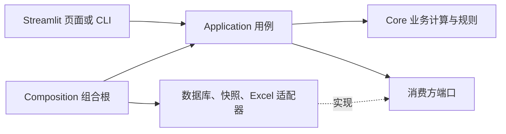

# 后端 DDD 架构评估与分级优化建议

评估日期：2026-09-09  
评估对象：`vivo-project` 当前工作区，Git 基准 `d209ced`，包含尚未提交的现有内容。  
主要范围：`src/`；为确认入口、状态修改和交付边界，补充检查 `app/`、`tests/`、`tools/`、项目配置和 ADR。

## 1. 结论

**当前项目基本符合中小规模企业内部报表系统的模块化、分层和可测试性要求，但尚不能认定为完整具备企业生产保障的 DDD 架构。建议继续采用模块化单体，优先补齐数据失败语义、持久化保护、编辑权限边界和可重复交付。没有证据支持现在引入微服务或全套复杂 DDD 战术模式。**

更准确的定位是：**按业务域组织的分析型模块化单体，核心采用 DataFrame 计算和规则函数，部分用例采用端口与适配器，部分仍采用直接依赖仓储的传统分层。** 这比“严格 DDD”更贴近实际，也适合当前以查询、统计、修饰和报表为主的业务。

“企业级架构”没有适用于所有项目的单一认证清单。这里采用可核验的工程基线：业务边界清晰、依赖可控、失败不会伪装成正常结果、用户维护状态可保护和追溯、权限与实际用户角色一致、交付可重现。Microsoft 的单体架构指南同样认可单一部署单元内的逻辑分层，并用依赖倒置提高隔离性和可测试性；它不是要求本项目照搬 .NET 工程模板。[架构参考](https://learn.microsoft.com/en-us/dotnet/architecture/modern-web-apps-azure/common-web-application-architectures)

## 2. 扫描方法与边界

- 对 `src/` 的 **212 个 Python 文件**执行 AST 解析和静态导入检查，全部可以解析。补充阅读关键服务、仓储、组合根、缓存及文件写入代码。
- 归一化 `src.xxx` 与顶级包名后，未发现 `src/` 各业务域之间的显式绝对导入；针对 Core 的检查也未发现直接导入 application、infrastructure、Streamlit 或 SQLAlchemy。该结论不覆盖动态导入、运行时对象注入、共享文件或共享数据库造成的隐式耦合。
- 仓库有 **198 个 `test_*.py` 文件**。本次实际执行架构边界、Q-Time 仓储、Inline 快照及 Yield 数据策略相关测试，结果 **26 passed**；没有测量全项目覆盖率。
- 阅读项目架构、上下文、制造术语和相关 ADR，按项目约束保留 Streamlit 原生 payload 缓存、日期前推、修饰与仿造数据等既定语义。未把这些已接受的设计自动认定为错误。
- 本次没有访问真实数据库、启动生产服务、执行负载或故障注入，也没有核验公司 SSO、反向代理、备份平台或外部 CI。文中的风险路径来自代码推演，不代表已发生生产事故。
- 仓库没有 `.codegraph/`，因此使用 AST、文件搜索和定向阅读。仅新增本报告，不修改后端实现及已有用户变更。

## 3. 实际架构及已有优点

| 模块 | Python 文件数 | 实际情况 | 判断 |
|---|---:|---|---|
| `yield_domain` | 38 | application/core/infrastructure 齐全；领域计算较丰富；应用服务直接依赖仓储 | 业务拆分合理，端口隔离尚不完整 |
| `inline_domain` | 112 | 多报表共享规则和快照；有组合根、数据端口；修饰支路仍直接依赖基础设施 | 架构基础较好，但主链路和支路的隔离程度不同 |
| `indicator_domain` | 32 | Q-Time、IJP 为同级子模块；服务、端口、仓储及组合根明确 | 较好的后续重构参考 |
| `equipment_domain` | 12 | 核心计算独立；应用服务直接装配数据加载器与仓储 | 规模较小，适合渐进改进 |
| `iqc_domain` | 5 | 明确的 demo 报表和静态数据读取，没有 Core | 演示模块不必补造实体、聚合或领域服务 |
| `shared_kernel` | 13 | 配置、数据库连接、文件工具、时间和快照公共机制 | 当前体量可控；更接近共享技术基础模块 |

现有模块不是空目录：

1. **规则已有独立所有者。** Core 的计算与修饰规则不直接依赖 Excel 仓储；[架构测试](../../../../tests/architecture/test_decoration_boundaries.py)约束 Core 的 Excel I/O 和基础设施导入。
2. **已采用消费方定义的端口。** [Q-Time ports](../../../../src/indicator_domain/application/qtime/ports.py):29、45 定义数据和修饰端口；[Q-Time service](../../../../src/indicator_domain/application/qtime/service.py):45 通过构造参数接收依赖；[Inline composition](../../../../src/inline_domain/composition.py)集中装配部分用例。
3. **快照不只是简单缓存。** [Inline snapshot repository](../../../../src/inline_domain/infrastructure/shared/measurement_snapshot_repository.py):36 定义刷新结果，配合覆盖窗口、版本、增量和降级；[rolling snapshot](../../../../src/inline_domain/infrastructure/shared/rolling_snapshot.py):26、134 已有进程间锁和快照发布机制。Q-Time 也有源快照元数据与降级测试。
4. **Excel 写入已有保护。** [excel_tools](../../../../src/shared_kernel/utils/excel_tools.py):188 起有进程内互斥，后续采用临时文件、回读验证、备份和原子替换。不能笼统说项目没有并发或失败保护。
5. **配置、契约和回归设施已有基础。** `AppConfig` 使用 Pydantic；Q-Time 查询有日期窗口、筛选项校验；现有单元、集成和架构测试配合 [smoke 工具](../../../../tools/smoke.py)及 ADR。

应特别区分**运行时调用**和**源码依赖**。当前 `ARCHITECTURE.md` 的 `Application → Core → Infrastructure` 示意容易被误读为 Core 应依赖仓储；本次扫描并未发现这种直接导入。建议后续修正文档示意，目标关系可表达为：



此图表示目标依赖关系；并非宣称所有当前模块都已实现。

## 4. 高优先级：当前值得补齐的缺失项

下表已按建议执行顺序排列。H3 带有明确部署条件：如果普通查看者已能访问应用，应提前到第一批处理。

| 顺序 | 缺失项 | 当前影响 | 最小改造范围 |
|---|---|---|---|
| H1 | 数据失败、空结果和降级状态未统一 | 可能把查询失败或不完整窗口当作可用数据 | 数据加载边界、查询结果状态、错误封装 |
| H2 | 状态提交保护不一致，人工决策缺少版本和审计 | 快照覆盖失败、旧台账覆盖新决策、修改难追溯 | Yield 快照发布、Excel 提交边界 |
| H3 | 编辑权限没有可信身份边界 | 存在查看者与编辑者之分时，显示开关不能阻止修改 | 可信身份接入和写用例授权 |
| H4 | 部分应用用例缺少端口隔离及自动约束 | 文件和仓储变化传导到业务编排，测试需 patch 具体实现 | 先补修饰端口，渐进整理 Yield 和 Equipment |
| H5 | 仓库内缺少可核验的交付检查入口 | 换机、发布和升级依赖时，环境与行为难保证一致 | 锁定依赖交付、离线检查、发布说明 |

### H1：明确失败语义，把数据健康状态传到使用者

**证据与触发路径：**

- [Yield data_loader](../../../../src/yield_domain/infrastructure/data_loader.py):87–89 捕获异常后返回空 DataFrame；[Yield repository](../../../../src/yield_domain/infrastructure/repositories/yield_repository.py):237–250 按月分片查询，只收集非空分片，并再次把异常变为空表。
- 因此，一个月份查询失败、另一个月份成功时，失败分片可能与“该月无业务数据”无法区分，成功分片仍会进入拼接及后续快照保存。该部分窗口风险是基于当前控制流的推演，本次未向真实数据库注入故障。
- [Q-Time repository](../../../../src/indicator_domain/infrastructure/qtime/repository.py):241–248 在数据库失败后返回旧快照；普通 `fetch_details()` 在 :111–117 只取 `.frame`，没有把本次降级信息带出。**手动刷新已有成功标识检查**，见 [dashboard](../../../../app/sections/indicator_domain/qtime/dashboard.py):151–158；缺口主要是普通查询链路。
- 异常处理也不一致：[db_handler](../../../../src/shared_kernel/infrastructure/db_handler.py):81–82 和 [AOI_RS data_loader](../../../../src/inline_domain/infrastructure/aoi_rs/data_loader.py):78–79 将原始异常或 traceback 写入日志。驱动异常可能带有 SQL、参数或连接环境信息；未证实实际凭据已泄漏。

**建议：** 数据加载器失败时抛出稳定的类型化异常；由仓储决定是否使用旧快照。对分片窗口明确采用“完整成功才发布”，或者显式标记 partial，禁止默认为完整。统一轻量结果元数据，例如 `status=fresh/stale/partial/unavailable`、源数据覆盖窗口、最后成功刷新时间和安全错误码；空 DataFrame 本身不能代表加载失败。该元数据作为原生字典随缓存 payload 传递，继续遵守 ADR-0001。

普通查询也应展示必要的新鲜度提示。监控场景下数据不可用应显示“未知/不可用”，不能推导为零异常或正常。保持现有降级能力，不要求断库就停止全部报表。日志使用安全错误码、异常类型和关联标识；需要底层诊断时先脱敏，再写入受限日志。OWASP 明确要求控制日志中的敏感信息。[日志参考](https://cheatsheetseries.owasp.org/cheatsheets/Logging_Cheat_Sheet.html)

**验收：** 覆盖全量失败、单分片失败、合法空窗口、旧快照可用/不可用；失败不得发布“完整新快照”，普通查询可识别降级。用含虚构敏感字段的异常检查页面与日志不泄漏原始内容。

### H2：补齐快照安全发布，以及人工决策的版本检查和追溯

**证据与触发路径：**

- [Yield repository](../../../../src/yield_domain/infrastructure/repositories/yield_repository.py):193–198 直接 `to_parquet(self.snapshot_path)`，失败仅记日志。写入中断可能破坏此前可用快照；与 Inline 已有临时文件发布方式不一致。
- [Q-Time service](../../../../src/indicator_domain/application/qtime/service.py):147 接收完整台账上传；[decoration_repository](../../../../src/indicator_domain/infrastructure/qtime/decoration_repository.py):48 整体替换决策 sheet。台账字段见 [decoration](../../../../src/indicator_domain/core/qtime/decoration.py):27，未包含操作者及版本上下文。
- A、B 下载同一版本后分别修改，即使上传过程被互斥锁串行执行，B 的旧副本仍可能覆盖 A 刚保存的决策。原子替换保护文件完整性，不能解决这种业务层的丢失更新。

**建议：** Yield 使用同目录唯一临时文件、校验和原子替换；保留现有刷新、源时间和降级策略。人工台账下载时附带版本或摘要，提交时在同一锁内比较当前版本，冲突则拒绝并提示重新合并。记录操作人、时间、理由、前后值或变更集、输入及输出版本。为人工维护状态明确备份保留和恢复流程；已有单份 `.bak` 不等于完整的历史恢复策略。

这些措施可以仍在现有文件适配器内实现，不必立即上数据库、事件溯源或工作流平台。若审计记录与台账暂时无法原子提交，应显式设计提交编号和故障补偿，避免“审计写失败但修改已经成功”无法追踪。

**验收：** 写入或校验失败后原文件仍可读；两个旧版本提交会产生明确冲突；新增、修改和删除均可追溯；可以恢复指定备份并检查其他 sheet 未被破坏。多进程写入时另需进程间保护，不能把现有 `threading.Lock` 当作跨进程锁。

### H3：有查看者/编辑者之分时，建立最小写权限边界

**证据：** [Q-Time dashboard](../../../../app/sections/indicator_domain/qtime/dashboard.py):111 用 `?admin=true` 显示修饰入口；[decoration_admin](../../../../app/sections/indicator_domain/qtime/decoration_admin.py):53–60 调用保存服务；[service](../../../../src/indicator_domain/application/qtime/service.py):147–153 没有身份或权限参数。其他部分报表也采用类似管理显示开关。

**判断条件：** 若所有可访问应用的人都被明确允许修改所有共享报表，这可能是当前信任模型下的简化。若实际存在只读查看者，他们自行增加 URL 参数即可进入编辑流程，则构成当前应修补的授权缺口。没有核验网络入口和外部 SSO，不能据此宣称存在外网匿名漏洞。

**建议：** 复用公司的可信身份来源，先实现查看/编辑两类权限即可；在写用例入口校验，不能只靠隐藏按钮。默认拒绝未识别身份的修改。身份来源可以是现有网关或适合当前环境的 OIDC，不需要自建账号中心。Streamlit 官方也区分身份认证与授权，两者不能互相替代。[Streamlit 认证说明](https://docs.streamlit.io/develop/concepts/connections/authentication)；[OWASP 授权原则](https://cheatsheetseries.owasp.org/cheatsheets/Authorization_Cheat_Sheet.html)

**验收：** 查看者增加 URL 参数仍不能保存；编辑者可以保存；绕过 UI 直接调用写用例也要接受相同权限校验，并为 H2 提供可信操作者信息。

### H4：补齐正在使用的出站端口，逐步统一依赖约束

**证据：**

- [Yield service](../../../../src/yield_domain/application/yield_service.py):14、32 直接导入 Panel 仓储和人工覆盖读取器。
- [Parts service](../../../../src/equipment_domain/application/parts_service.py):22、99–101 直接调用加载函数并构造 `PartsRepository`。
- [Sheet OOS service](../../../../src/inline_domain/application/shared/sheet_oos_decoration_service.py):18、55、71 直接导入并调用持久化函数；[SPC service](../../../../src/inline_domain/application/spc/spc_service.py):19、37 还依赖基础设施错误类型和工作簿签名函数。
- 现有架构测试主要约束 Core 的持久化边界，尚不能完整约束上述 application→infrastructure 依赖。部分组合测试已存在，因此问题是约束覆盖不足，不是完全没有架构测试。

**建议：** 优先为正在整改的修饰提交、决策读取和签名读取定义少量 `Protocol`，错误类型放在消费方契约附近，具体 Excel 实现由组合根注入；随后在需要修改 Yield/Equipment 时引入数据端口。沿用 Q-Time 已有做法，不引入 DI 容器、通用 CRUD 基类或“一函数一接口”。

增加轻量 AST 约束，检查 Core 禁止持久化、已迁移 application 禁止具体仓储、跨域只经明确公共契约。存量例外列清单并逐步缩减，不要求一次性全项目改造。同步澄清架构文档中的依赖箭头。

这是隔离能力的补齐，优先级低于数据正确性和权限问题。直接依赖一个仓储本身不等于生产故障，也不必为了严格“纯净”把所有小服务重写。

**验收：** 应用服务可用内存 fake 运行，不需要导入真实 Excel/数据库适配器；更换适配器不改 Core 规则；新增依赖越界能被测试发现。

### H5：建立可重复的最小发布与检查流程

**证据：**

- [pyproject.toml](../../../../pyproject.toml) 中两个内部包使用 `../packages/...` 的 editable 本地路径；仅复制本仓库不能保证依赖完整。已有 `uv.lock` 和 `requirements_locked.txt`，不能说项目没有依赖锁定。
- `pyproject.toml` 同时把 pytest 放在运行依赖与开发依赖中；Pyright 屏蔽了参数、调用和返回类型等关键诊断。这些不是需要单独大改的高危问题，但会削弱接口检查效果。
- 本次未发现仓库内 GitHub Actions、GitLab CI、Jenkinsfile、Azure Pipelines、tox/nox 或 pre-commit 配置。外部流水线是否存在未知。
- [smoke.py](../../../../tools/smoke.py):42–49 的 `all` 指向 `tests/unit`，并不包含 `tests/architecture`，所以“smoke all 成功”不等于架构检查已执行。

**建议：** 先提供一个明确的发布检查命令：架构测试 + 受影响域单测 + 选定关键离线契约测试。约定一个权威锁定安装流程，为内部包提供固定版本构建物或版本明确的配套源码交付；说明配置、密钥注入、人工资源迁移、备份和回滚步骤。在新增端口附近渐进恢复有价值的类型检查，不要求现在清零全仓历史类型问题。

可以先用本地脚本或现有公司流水线完成，无需搭建大型 CI/CD 平台。若公司已有外部流程，应把实际入口与职责记录到仓库，而不是另建重复系统。

**验收：** 在干净 Windows 环境按文档可完成固定版本安装和离线检查；缺少内部包或配置时有明确错误；检查失败返回非零；发布前确认人工维护文件不会被部署包覆盖，回滚路径可执行。

## 5. 低优先级：未来需要时再引入的能力

以下均是条件性建议，不应作为当前架构“不合格”的理由。

| 能力或模块 | 什么时候需要 | 届时建议 | 当前先做什么 |
|---|---|---|---|
| 更丰富的聚合、值对象与 Unit of Work | 出现审批、撤销、生效期、多记录一致性修改等真正的业务状态生命周期 | 围绕一致性边界定义聚合；应用自有写库使用事务/UoW 和版本迁移 | 分析型 DataFrame 保持现状；查询源库不因 DDD 名义被要求自建 ORM |
| 人工决策数据库与 schema migration | 多用户高频编辑、多进程共同维护文件、历史查询或保留要求超出 Excel 能力 | 将决策与审计迁入应用自有数据库，Excel 保留导入导出功能 | 先完成 H2 的版本检测、原子提交和备份 |
| 后台任务执行模块 | 计算或导出持续超过交互等待目标，重复刷新争用 CPU/数据库，或需断线后继续运行 | 先用独立 worker 与简单任务表；需要可靠重试、调度扩容时再选任务队列 | 沿用现有显式 CLI/Windows 定时任务，明确失败状态和重复执行语义 |
| 专用查询模型或 CQRS | 报表查询与决策写入在性能、权限、模型或扩容方面明显分化 | 先在单进程/单库分离读写接口，必要时再引入独立读库及投影 | 现有查询与修饰边界继续清晰化，不强加命令总线 |
| 领域事件、Outbox、消息中间件 | 一次状态变更必须可靠驱动多个独立系统，需重试、去重和最终一致性 | 根据真实事件定义契约，数据库事务结合 Outbox，消费者实现幂等 | 同进程调用继续使用普通函数或端口 |
| API 适配层与应用缓存分离 | 第二个前端、外部系统或批处理需要独立调用同一应用用例 | 增加 HTTP/API 适配层，把 Streamlit 专属缓存逐步放在入口适配层 | 保留 ADR-0001，不为了架构图提前删除 `st.cache_data` |
| 集中可观测性和 SLO | 多实例、无人值守运行、明确的可用性/报表时效承诺，排障需要跨进程关联 | 采集刷新耗时、失败率、快照年龄、内存和队列积压；多服务后再引入分布式追踪 | H1 提供可识别状态，现有日志先统一安全字段和关联标识 |
| 多实例缓存、共享存储与高可用 | 单机容量或停机时间无法满足业务，部署多个 Streamlit 实例 | 评估共享文件一致性、会话路由、缓存失效与主写者；按需选择对象存储、数据库或 Redis | 不把本地缓存直接假设成分布式一致缓存 |
| 细粒度权限与数据隔离 | 不同部门、工厂或客户拥有不同产品/厂别访问范围 | 扩展作用域授权、数据过滤和审计，确保缓存键包含授权范围 | 先做好 H3 的可信身份和编辑权限 |
| 微服务与明确的跨上下文契约 | 多个团队需要独立发布，某领域需独立扩容/隔离故障，模块边界已经稳定 | 按真实业务和团队边界逐个提取，先解决共享文件/数据库隐式耦合 | 保持模块化单体；`*_domain` 目录不自动等于独立限界上下文 |
| 统一安装包及唯一 Python 导入命名 | 需要 wheel 安装、命令行长期运行、跨服务复用，或遇到热重载/类身份问题 | 选择统一包名并逐步移除重复 `sys.path` 和两种导入路径 | Yield 当前混用 `src.yield_domain` 与 `yield_domain`；有风险但未证实本次造成故障 |

CQRS 指南强调按读写复杂性选择模式，并非简单 CRUD 或所有系统都适用；微服务也需要相应的部署、监控与运维能力。因此，上述演进应由具体需求触发。[CQRS 适用条件](https://learn.microsoft.com/en-us/azure/architecture/patterns/cqrs)；[Monolith First](https://martinfowler.com/bliki/MonolithFirst.html)；[Microservice Prerequisites](https://martinfowler.com/bliki/MicroservicePrerequisites.html)

可观测性选择同样应围绕用户可见故障与运行目标，先关注延迟、错误、流量和资源饱和度，并补充本项目特有的“数据新鲜度”。后者是针对报表业务的建议，不是 Google 文档原有指标。[SRE 监控参考](https://sre.google/sre-book/monitoring-distributed-systems/)

## 6. 建议推进顺序与本次验证

**第一批：保证结果可信和状态可恢复。** 实施 H1，以及 H2 的 Yield 快照安全发布和台账版本检查。若存在只读用户，同批处理 H3。这些工作直接保护现有业务，不依赖扩大项目规模。

**第二批：让后续修改更稳。** 完成 H2 的审计恢复、H4 的关键端口和约束、H5 的可重复发布入口。边界调整跟随具体用例，避免一次性重写领域算法。

**后续：按观测到的瓶颈选择第 5 节能力。** 没有明确触发条件的模块暂不引入。缺少微服务、事件总线、完整 CQRS、实体基类或 DI 框架，不构成本项目当前架构缺陷。

本次实际执行：

```powershell
.venv/Scripts/python.exe -m pytest -q `
  tests/architecture `
  tests/unit/indicator_domain/infrastructure/qtime/test_repository.py `
  tests/unit/inline_domain/infrastructure/measurement/test_measurement_snapshot_repository.py `
  tests/unit/test_yield_repository_data_policy.py `
  --basetemp=output/test-results/backend-architecture-review-pytest
```

结果：`26 passed in 2.70s`。这些测试验证现有边界和快照策略的部分行为，不证明新增建议已实现，也不代表全量回归、真实数据库集成或企业生产认证已经完成。
