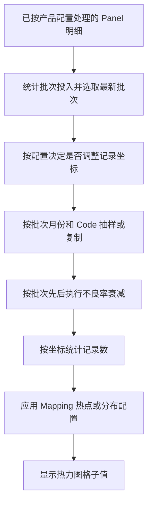

# 入库良率修饰表的“缩放倍数”如何影响 Mapping

核对日期：2026-09-21。范围：当前入库不良率分析看板的 Code Mapping 链路。本文解释现有实现，不调整业务规则，也不改写工作簿。

## 1. 先明确：它调整什么

“缩放倍数”先改变某个 **批次、某个 Code 的不良明细行数**，再由这些明细统计 Mapping 各坐标的计数。

- 小于 1：从现有明细中抽取一部分，减少计数。
- 大于 1：复制现有明细，增加计数。
- 等于 1：月度倍率这一阶段不增不减。

它不是直接给热力图每个格子的数字乘倍率。因此，倍率为 0.5 时，并不保证每个格子都恰好减半；倍率为 1.5 时，也不保证每格都恰好变成原值的 1.5 倍。

还要区分两个对象：

| 对象 | 含义 |
|---|---|
| Mapping 的格子值 | 当前批次、当前 Code 在这个坐标上的计数，经矩阵修饰后展示；不是不良率 |
| 批次标签括号内的投入数 | 月度缩放之前统计的批次去重 Panel 数；月度倍率不会同步放大这个分母 |

## 2. 倍率从哪里来，能否直接修改该列

Mapping 消费的是 `<产品>_Code级` Sheet。`Group级` Sheet 的缩放倍数不直接传入 Code Mapping。

**“缩放倍数”列是派生结果，不是独立的人工控制输入。** 服务读取工作簿后，会根据“当月良损”和“指定良损”重新计算倍率，并在同步时回写该列。实际计算不直接采用 Excel 中现成的“缩放倍数”数值。

计算步骤如下：

1. 优先取该 Code 当月的“指定良损”。
2. 当月未指定时，取最近一个更早月份的非空“指定良损”；明确填写的 `0` 也是有效指定值。
3. 设解析后的指定值为 `S`，“当月良损”为 `R`：

```text
若 S 存在，且 R 非空、非零：f = round(min(3.0, max(0.3, S / R)), 3)
否则：                       f = 1.0
```

“当月良损”同步写表时保留 5 位小数，计算出的倍率截断到 **[0.3, 3.0]** 后保留 3 位小数。回写工作簿的倍率与 Mapping 使用的倍率一致；即使良损和指定值未变，旧倍率需要截断时也会回写。该规则不改变月周日趋势的指定目标。

| 当月良损 R | 有效指定良损 S | 倍率 f | 解释 |
|---:|---:|---:|---|
| 0.01000＝1% | 0.00500＝0.5% | 0.500 | 减少不良明细 |
| 0.01000＝1% | 0.02000＝2% | 2.000 | 增加不良明细 |
| 0.00013＝0.013% | 0.00077＝0.077% | 3.000 | 原比例约 5.923，截断到上限 3 |
| 0.01000 | 0 | 0.300 | 原比例为 0，截断到下限 0.3 |
| 0 | 0.00078 | 1.000 | 分母为零，不能按比例反推不良数量 |
| 非零 | 当前及历史均未指定 | 1.000 | 没有人工指定目标，不执行月度倍率调整 |

如果要通过修饰表改变 Mapping，应调整相应 Code/月的“指定良损”，再按报表刷新流程同步。只修改“缩放倍数”列，不能可靠控制结果。

## 3. 匹配的是“批次所属月份”，不是入库月份

实际查找键是：

```text
(defect_desc, 从 batch_no 解析出的 YYYY-MM)
```

例如，`batch_no = 2026/08/28-LOT1`，使用这个 Code 的 **2026-08** 倍率，即使该批次某些 Panel 是 9 月入库。

这里存在两个不同时间口径：

- 修饰表的“当月良损”：按 Panel 的 `warehousing_time` 统计。
- Mapping 选择倍率：按 `batch_no` 中的日期所属月份匹配。

所以，修改 9 月倍率，不一定影响当前看到的所有 Mapping 批次。需先看批次名称中的日期。

未找到 `(Code, 月份)` 倍率时默认 `1.0`。`compute_scale_factors` 只为表中实际存在的月份行生成倍率；缺行时，Mapping 不会自行凭历史指定值创建一个新的月份倍率。

## 4. 小于 1：按明细抽样缩小

设某批次、某 Code 经过前置处理后有 `N` 行不良明细，月度倍率为 `f`：

```text
目标行数 T = int(N × f)
```

由于允许的倍率为正，这里的 `int` 相当于向下取整，不是四舍五入。

当 `T < N` 时，调用：

```python
df_group.sample(n=T, random_state=42)
```

这是从现有行中不放回抽样，不是逐格乘法。同一份输入及行顺序下，固定种子会选出同样的行；输入数据或顺序发生变化时，不保证仍是同一组记录。

| N | f | T | 结果 |
|---:|---:|---:|---|
| 100 | 0.5 | 50 | 保留 50 行 |
| 7 | 0.3 | 2 | 2.1 向下取整为 2 |
| 1 | 0.5 | 0 | 唯一一行被移除 |
| 10 | 0.3（原比例为 0） | 3 | 原比例先截断到 0.3，再保留 3 行 |

**格子示例：**按 A、B、C 的顺序输入 10 行，三个坐标原来分别有 `4、3、3` 行。倍率为 `0.5` 时，本次代码验证保留 5 行，对应计数是 `2、1、2`，不是 `2、1.5、1.5`。

这里的分布只是该示例的固定抽样结果，不是对所有 Mapping 都成立的分配公式。

## 5. 大于 1：整倍复制，再补余数

仍先计算 `T = int(N × f)`。当 `T > N` 时：

```text
整倍份数 q = T // N
余数     r = T % N

结果 = q 份完整明细 + 从原明细中抽取 r 行
```

例如 `N = 10，f = 2.3`：

1. 目标为 `23` 行。
2. 保留原来的 10 行。
3. 完整复制一份，增加 10 行。
4. 用固定种子从原来的 10 行中抽取 3 行，再增加 3 行。
5. 最终得到 23 行。

新增行的 `panel_id` 会增加后缀：整倍副本如 `_SIM_M1`，余数副本为 `_SIM_MREM`。这些是展示计算中的复制记录，不代表实际新增了物理 Panel。

### 复制后落在哪个坐标

坐标解析读取 `panel_id[11:13]` 和 `panel_id[13:15]`。新增后缀位于末尾，不改变这两个坐标片段，因此副本仍落在被复制记录的同一坐标。

沿用前面的 `A=4、B=3、C=3` 示例：

| 倍率 | 月度缩放后总行数 | A | B | C |
|---:|---:|---:|---:|---:|
| 1.0 | 10 | 4 | 3 | 3 |
| 1.5 | 15 | 6 | 4 | 5 |
| 2.0 | 20 | 8 | 6 | 6 |
| 2.3 | 23 | 9 | 7 | 7 |

整数倍完整复制时，这一阶段各格计数可等比例增加；有余数抽样时，各格增加量不一定严格成比例。该表只演示月度缩放步骤，尚未执行后面的批次衰减及热点处理。

另外，`N=10，f=1.05` 时 `T=int(10.5)=10`，实际不会增加任何行。倍率略大于 1，在小样本上可能看不到变化。

## 6. 为什么最终图值不是“原值 × 倍率”

当前看板的数据流程是：



### 6.1 前置输入与批次筛选

Mapping 输入来自 `get_modified_panel_details`，已应用产品配置中的 `defect_multipliers`，不是直接使用全部数据库原始记录。

准备 Mapping 时，先按批次去重统计 `panel_id` 得到投入数，再筛选投入达到阈值的批次，取日期最新的最多 5 个。这 5 个是当前输入范围内统一选择的，不是为每个 Code 单独选择 5 个。

有可解析日期时，仅可解析日期的批次参与这次选择；全部解析失败时才回退为字符串排序选取 5 个，此时没有可用月份，月度倍率默认 1。

### 6.2 坐标处理

没有匹配的专用方案时，默认位置处理会给行、列各施加可重复的小偏移，并限制在布局范围内。它发生在月度缩放之前。因此，复制的是位置处理后的明细。

`original/raw/none` 等方案可以保留该步骤的原坐标，但**不会因此跳过月度倍率或后续批次衰减**。

### 6.3 批次不良率衰减

对每个 Code，按选中批次从旧到新处理。用月度缩放后的行数 `N_b` 和月度缩放前的投入数 `P_b` 计算：

```text
当前率 = N_b / P_b
```

当前页面未额外传入 `scaling_factor`，其默认值为 `1.0`。这个参数与修饰表的月度倍率是两件事。

- 该 Code 第一个仍有明细的批次：以“当前率 × scaling_factor”建立初始上限。
- 后续仍有该 Code 明细的批次：上限在上一次理论上限基础上乘 `0.95`。
- 本批目标率取“当前率”和“新上限”中的较小值，再转换为整数行数并抽样。
- 传给下一批的是理论上限，**不是本批实际较低的目标率**。没有该 Code 明细的批次不会推进这个 Code 的衰减。

示例：3 个批次各投入 10,000，缩放前各有 100 行同一 Code；倍率均为 2，页面 `scaling_factor=1`：

| 批次顺序 | 月度缩放后行数 | 不良率上限 | 衰减后行数 |
|---|---:|---:|---:|
| 最旧 | 200 | 2.000% | 200 |
| 次新 | 200 | 1.900% | 190 |
| 最新 | 200 | 1.805% | 180 |

因此，同样填写倍率 2，后续批次最终保留的行数也可能不足原来的 2 倍。

此阶段只减少已有行数，不再复制；当本批还有行时，目标行数至少保留 1 行。这个“至少 1 行”不会恢复已在月度缩放阶段降为 0 的 Code/批次。

### 6.4 坐标聚合与矩阵配置

页面从剩余记录解析坐标，用 `pivot_table(..., aggfunc='count')` 计数，**不是 `nunique` 去重计数**。同坐标的复制行因此会计入该格。

坐标无法解析的记录不进入矩阵，所以“明细总行数”也可能大于“格子计数总和”。

随后还会应用独立的 Mapping 配置：

| 模式 | 对矩阵的作用 |
|---|---|
| 默认位置处理或 `original/raw/none` | 矩阵阶段不再改变计数 |
| `multiplicative` | 按热点区、普通区各自的倍率修改格子，可能改变总数 |
| `additive` | 按热点区、普通区给格子加值，可能改变总数 |
| `random` | 按配置重新分配位置，当前实现保留输入矩阵总计数 |

热点行／列的加值或乘法模式还可能叠加确定性的扰动，最后转为非负整数。它们均发生在修饰表月度倍率之后，不能把最终效果全部归因于“缩放倍数”。

## 7. 必须留意的边界

| 情况 | 当前处理 |
|---|---|
| 有限倍率小于 0.3（包括 0、负数） | 截断为 **0.3** |
| 有限倍率大于 3（包括 10） | 截断为 **3.0** |
| 倍率在 [0.3, 3.0] 内 | 正常使用，包含两个边界 |
| 倍率为 NaN、无穷或无法转为数字 | 记录错误并按 1.0 处理 |
| 找不到匹配的 Code/月倍率 | 按 1.0 处理 |
| 当月原始良损为 0，而指定良损大于 0 | 倍率计算回退为 1.0，不通过除零制造新记录 |
| 某批次本来没有该 Code 的记录 | 无行可复制，倍率大于 1 也不会凭空创建坐标 |
| 倍率为 1，但图仍变化 | 检查前置数据、坐标处理、批次衰减和热点配置 |

Mapping 月度复制阶段没有把不良行数强制限制为批次投入数。因此，特别是在较大倍率下，这里的展示计数不应直接解释成真实、去重的物理 Panel 数。

下限 0.3 也不保证每批至少保留一行：例如 `int(1 × 0.3) = 0`。整数取整、后续批次衰减和热点配置均可能使最终格子计数超出原值 0.3～3 倍的范围；本规则只约束月度倍率。

**图像是否展示另有门槛：**手动 Code 筛选和自动预警图像共用近三个月月均不良率 `>= 0.01%`，自动区还要求命中预警。阈值由 `config/domain/yield_domain.yaml` 的 `dashboard.code_monthly_rate_threshold` 配置（`0.0001 = 0.01%`）。三个月月度结果均为零时，即便 Mapping 有值，默认也不展示该 Code 图像；没有月度数据同样不展示。

## 8. 与上一问题中的 G向群暗线有什么关系

此前核对到：M626 的 G向群暗线 8 月指定良损为 `0.00078`，9 月原始良损为 0。

- **月周日趋势**可以沿用 8 月指定值，把 9 月目标设为 `0.00078`，按投入容量生成日度计数。
- **Mapping**遇到“原始良损为 0”时，倍率为 `1.0`；某批次没有该 Code 的明细时，也不能靠复制产生 Mapping。

所以“趋势图有 0.08%，Mapping 没有对应计数”在当前实现下是可能的。两者共享指定来源，但生成方法、月份匹配口径和后续处理不同，不能要求数值严格相等。这里仍保留现有业务规则，没有新增“零原始良损时如何生成 Mapping”的规则。

## 9. 排查某个格子为什么变大或变小时的顺序

1. 确认产品、Code、批次，以及批次名称所属月份。
2. 查看 Code Sheet 对应月的“当月良损”、当前或历史“指定良损”，重算 `f`。
3. 检查原比例是否被截断到 [0.3, 3.0]，或因零分母、缺行而回退为 1。
4. 查看该批次、该 Code 进入月度缩放步骤时的实际行数，计算 `int(N × f)`。
5. 查看这个 Code 在批次序列中的位置及衰减上限。
6. 检查坐标是否有效，以及是否匹配了热点／随机分布配置。
7. 确认页面使用的是同步后的配置和数据；该报表的普通筛选交互会复用已有 Mapping 数据，修改工作簿后需按“刷新缓存”流程同步。

## 10. 代码依据与验证范围

| 环节 | 实现位置 |
|---|---|
| 倍率公式、历史指定回退 | [`compute_scale_factors`](../../../../src/yield_domain/core/mwd_trend/modifier_table.py) |
| 工作簿同步、派生倍率回写 | [`sync_modifier_table`](../../../../src/yield_domain/application/modifier_table_service.py) |
| Mapping 只接收 Code 级倍率 | [`_build_modifier_context`、`get_mapping_data`](../../../../src/yield_domain/application/yield_service.py) |
| 倍率统一边界 | [`scale_policy.py`](../../../../src/yield_domain/core/mapping/scale_policy.py) |
| 抽样复制、批次衰减 | [`mapping_processor.py`](../../../../src/yield_domain/core/mapping/mapping_processor.py) |
| Panel ID 坐标解析与默认偏移 | [`panel_position.py`](../../../../src/yield_domain/core/mapping/panel_position.py) |
| 批次投入去重统计 | [`BatchStatistics`](../../../../src/yield_domain/core/batch_statistics.py) |
| 坐标聚合与矩阵配置调用 | [`_prepare_mapping_matrices`](../../../../app/sections/yield_domain/yield_dashboard.py) |
| 热点／随机分布处理 | [`hotspot_modification.py`](../../../../src/yield_domain/core/mapping/hotspot_modification.py) |
| 热力图数值展示 | [`create_mapping_heatmap`](../../../../app/charts/yield_domain/sheet_lot_chart.py) |

领域规则参见：[MWD 月周日趋势处理算法](../../../../references/domain/yield_domain/algorithm-mwd-trend.md)。

本文的抽样、复制与三批次 `200 → 190 → 180` 示例来自内存构造数据验证。新增边界规则由单元测试覆盖：包括零倍率、低于下限、两个边界、超过上限、派生倍率回写及两处图像门槛一致性。验证只使用内存数据和临时工作簿，不读写生产工作簿，也不是对某一张生产 Mapping 图逐格数值的复算。
