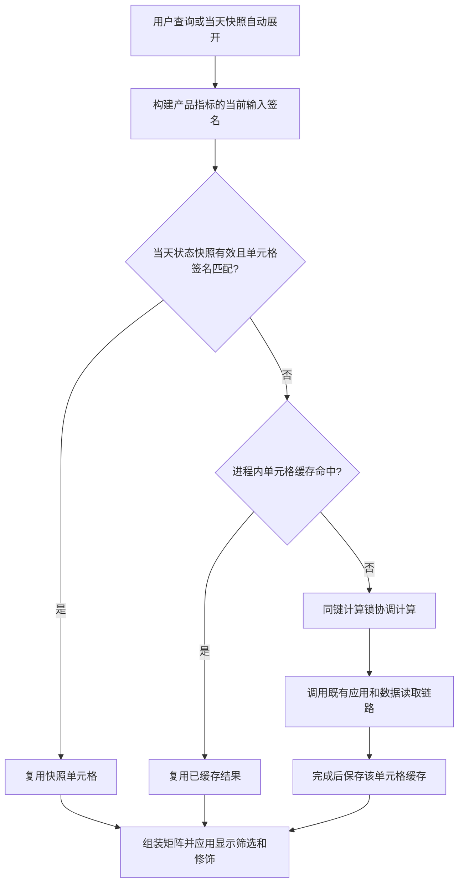

# 多用户看板共享缓存设计

核验日期：2026-09-11。本文以全指标预警矩阵的当前实现为依据，记录可供其他看板采用的设计约定。
不表示所有页面已完成同样改造；配置、容量与数据依赖以对应实现为准。

## 1. Streamlit 能力与项目设计的边界

这些机制不是全部由项目自行实现，也不是只加一个缓存装饰器就自动具备。
Streamlit 提供缓存基础能力，项目代码决定缓存什么、如何识别同一份结果、何时失效以及怎样被页面消费。

| 机制 | Streamlit 提供 | 项目负责 |
|---|---|---|
| 跨用户复用 | 默认全局作用域的 `st.cache_data` 在同一服务进程内跨会话共享；返回数据副本 | 将共同计算放入缓存函数，避免把用户会话标识加入共享结果的缓存键 |
| 同键并发协调 | 对同一缓存键使用计算锁，并在取得锁后再次检查缓存 | 构造一致的业务键；不同参数、不同版本不属于同一键 |
| TTL 与容量淘汰 | 实施配置的过期和条目数量限制 | 选择 `ttl`、`max_entries`，统一配置来源并评估内存成本 |
| 自动失效 | 基于缓存函数代码及参与哈希的参数识别结果 | 将源数据、配置、时间口径及人工版本纳入参数；框架不会自动发现外部 Excel 或数据库内容变化 |
| 产品指标隔离 | 缓存不同参数对应的结果 | 按“产品 × 指标”拆分计算，避免刷新一个单元格导致整板失效 |
| 收起、查询与筛选 | 提供会话状态和页面重跑机制 | 用会话状态控制显示，用共享缓存承载计算；收起不清缓存 |
| 独立定时运行、跨进程复用 | 默认内存数据缓存不能承担这项职责 | 定时脚本、任务计划程序、状态快照、原子发布及快照有效性检查 |

同键计算锁不是分布式锁，也不保证计算“永远只执行一次”：异常、中断、过期、淘汰或版本变化后仍可重新执行。
缓存命中仍有读取、反序列化、签名检查和页面渲染开销，不能把加载动画理解为底层全量重算。

## 2. 状态与计算分离

页面的 `alert_matrix_board_loaded`、当前选中详情以及筛选条件属于用户会话状态。
它们控制该用户看什么，不拥有或清除其他用户的计算结果。

矩阵按以下顺序读取每个产品指标的状态：

矩阵状态与详情分开缓存。只有选中预警单元格才加载详情；完成全矩阵状态计算不等于所有详情图像已预计算。
图表可能使用会话内渲染备忘，跨用户共享数据不代表共享所有绘图对象。

## 3. 缓存身份与定向失效

`_cached_alert_matrix_cell` 的身份包括指标、产品、参考周、输入签名和产品指标 revision。
当前签名含指标真实输入、报告截止策略、revision 与参考周；Q-Time 还包含参考日期。
各指标的源签名由 `build_cell_source_signature` 选择，不统一拼入整板或全部产品版本。

管理员定向刷新通过 `get_indicator_product_revision` / `bump_indicator_product_revision`
读写持久 revision。版本使用唯一值，临时文件写完后替换；多个会话可观察同一版本变化。
旧缓存条目不必立即删除，新版本自然使用新键。不要用全局 `st.cache_data.clear()` 实现单产品刷新。
需要更新底层数据时，还应调用对应指标已有刷新入口，单纯改变版本不等于强制数据库全量读取。

定向失效存在实际依赖边界：例如多个产品读取同一个 Excel 工作簿时，工作簿级文件签名变化可能使这些产品的同类指标一起失效。
因此“产品指标定向刷新”不意味着所有外部源变化都严格只影响一个单元格。

详情键包括单元格身份、参考日和版本，页面还传入计算时间等标识。
Yield 详情包含跨指标图像，会额外跟踪完整规格及修饰等输入；CPK 台账历史详情使用自身载荷版本标识。
改变详情载荷结构时应显式更新版本，不能依赖被排除哈希的 `_loader` 闭包自动使旧载荷失效。

## 4. 容量与有效期

核验时 `application.cache_ttl_hours = 12`，通过 `ConfigLoader.get_cache_ttl_seconds()` 读取。
TTL 是复用上限，不是每隔 12 小时自动后台执行；失效后的下一次读取才触发计算。

| 层次 | 当前容量 | 估算依据 |
|---|---:|---|
| 矩阵状态 `_cached_alert_matrix_cell` | 1024 条 | 7 个产品 × 8 个指标 = 56 条／完整版本 |
| 详情 `_cached_matrix_detail_bundle` | 128 条 | 单日单版本至多 56 个产品指标组合，实际只加载用户点开的预警详情 |

`max_entries` 是每个缓存函数的不同键数量，不是用户数、DataFrame 行数或全站共用额度。
10 个用户请求相同版本的 56 个单元格，仍只需要这 56 个共享条目。
1024 条约能容纳 18 套完整矩阵版本，128 条约能容纳两套完整详情版本；这是静态容量对比，不是保留时长保证。
底层 Yield、Excel、Q-Time 等函数有自己的容量和键空间，不能用矩阵的 1024 条替代评估。

后续容量评估采用“产品数 × 指标数 × 时间窗口数 × 活跃输入版本数”，并结合实际访问范围。
详情包含较大 DataFrame，调大容量前应检查进程内存、输入版本变化频率和缓存未命中原因。
优先解决无意义的签名变化与错误失效；不能把“加大 max_entries”当作所有重算问题的解决方法。
当前矩阵容量有余量，但没有据此宣称整个系统已完成生产负载或内存压测。

## 5. 页面关闭、重启与独立任务

| 操作 | 当前行为与边界 |
|---|---|
| 收起后再查询 | 不清缓存；已完成且仍有效的单元格复用，未完成部分可能重新执行 |
| 浏览器刷新、关闭后重开、换人访问 | 同一服务进程的有效缓存可复用；会话显示状态可重新初始化 |
| 加载途中离开 | 手动页面查询不是可靠后台作业，不保证未完成计算继续或断点续算 |
| Streamlit 服务重启 | 内存缓存丢失；持久快照仍须通过日期、策略、TTL 和签名检查才能复用 |
| 多个独立服务进程 | 不共享默认内存缓存及计算锁；共同访问有效快照可复用已发布结果，但没有跨进程计算去重保证 |
| 关闭网页时计划任务运行 | 独立 Python 进程继续执行，不依赖页面会话；机器和登录等条件见定时任务说明 |

`tools/warm_alert_matrix.py` 调用既有矩阵入口，使用 `reuse_snapshot=False` 生成本次状态，
发布至 `output/cache/alert_matrix/daily.json`。它不强刷所有底层原始快照。
文件采用同目录唯一临时文件加原子替换，避免读到半写入 JSON。
快照版本、报告日期、报告截止策略、TTL及单元格源签名共同控制是否可复用。
快照只保存状态载荷，不保存数据库连接或完整详情图像；错误状态不得伪装为正常结果。

## 6. 后续看板应遵守的设计约定

1. 分离会话显示状态、共享业务数据、持久快照和人工维护台账；收起操作不得顺带清除共享数据。
2. 以业务独立计算单元拆分缓存；只有会影响结果的用户或权限维度才进入键。涉及不同可见数据时必须保留权限隔离，不能盲目跨用户共享。
3. 显式编码全部影响结果的输入版本、时间口径和配置依赖；缓存命中不应掩盖数据健康状态。
4. 昂贵计算才放入数据缓存，默认只读；可变业务类型在缓存外重建，遵守原生载荷契约。
5. 查询、显示更新、业务结果失效和数据源强刷使用不同语义，按范围调用已有入口。
6. 对跨会话复用、定向失效、同键并发、过期和容量淘汰按改动范围验证；新建持久快照还应验证失败保留旧文件与版本变化。
7. 需要可靠离线完成时使用独立作业及结果发布协议，不以浏览器会话维持计算生命周期。

## 7. 实现与验证依据

- [矩阵缓存与源签名](../../../app/sections/inline_domain/monitor/alert_matrix_cache.py)
- [产品指标 revision](../../../app/components/indicator_cache.py)
- [页面查询与收起门控](../../../app/pages/自动预警看板.py)
- [详情缓存与绘图入口](../../../app/sections/inline_domain/monitor/alert_matrix_detail.py)
- [持久矩阵快照](../../../app/sections/inline_domain/monitor/alert_matrix_snapshot.py)
- [跨会话复用测试](../../../tests/unit/app/pages/test_auto_warning_shared_cache.py)
- [单元格隔离测试](../../../tests/unit/app/sections/monitor/test_matrix_cell_isolation.py)
- [快照有效性与跨进程边界测试](../../../tests/unit/app/sections/monitor/test_alert_matrix_snapshot.py)（通过新建存储对象、清理内存缓存模拟进程边界）
- [原生缓存载荷契约](../../../docs/ADR/0001-streamlit-cache-native-payload-boundary.md)
- [系统数据刷新机制](data-flow-infrastructure-refresh.md)：底层仓储、原始快照与增量读取规则
- [矩阵定时任务注册](../../../tools/register_alert_matrix_task.ps1)与[预计算入口](../../../tools/warm_alert_matrix.py)：运行条件、发布流程及退出码

Streamlit 自带部分已核对本项目安装包的 `runtime/caching/cache_data_api.py`（默认 global 作用域）
及 `runtime/caching/cache_utils.py`（按键计算锁与二次检查）。升级框架后应重新核验相关语义，
不能将本项目的“同进程共享”扩展解释为跨机器缓存或持久后台计算。
