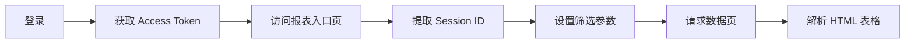

# 帆软报表 API 逆向工程 Skill

> **技能标识**: `finereport-crawler`  
> **版本**: 1.0.0  
> **适用场景**: 对任意帆软 FineReport 10.0 报表系统进行 API 逆向分析与数据爬取  
> **核心能力**: 从零开始探测登录机制 → 定位报表入口 → 提取 Session → 发现筛选参数 → 爬取数据

---

## 目录

1. [概述](#1-概述)
2. [前置知识](#2-前置知识)
3. [方法论总览](#3-方法论总览)
4. [步骤详解](#4-步骤详解)
   - [4.1 登录 API 逆向](#41-登录-api-逆向)
   - [4.2 报表入口 URL 发现](#42-报表入口-url-发现)
   - [4.3 Session ID 提取](#43-session-id-提取)
   - [4.4 筛选参数探测](#44-筛选参数探测)
   - [4.5 筛选参数值发现](#45-筛选参数值发现)
   - [4.6 筛选条件提交](#46-筛选条件提交)
   - [4.7 数据提取与解析](#47-数据提取与解析)
5. [探针脚本范式](#5-探针脚本范式)
6. [经验与陷阱](#6-经验与陷阱)
7. [参考资源](#7-参考资源)

---

## 1. 概述

帆软 FineReport 是一个企业级 Web 报表工具。对其 API 进行逆向工程的**本质**是：

> **理解一个 SPA（单页应用）的 HTTP 通信协议，模拟浏览器行为完成身份认证 → 会话建立 → 状态修改 → 数据获取 的完整链路。**

本 Skill 记录的是通用的方法论，可适配任意 FineReport 10.0 报表系统。

### 典型链路



---

## 2. 前置知识

| 领域 | 要求 |
|------|------|
| HTTP 协议 | 理解 GET/POST、Cookie、Header、form-data vs JSON |
| Python | `requests` 库的基本使用 |
| HTML 解析 | `BeautifulSoup` 或正则表达式 |
| 浏览器 DevTools | Network 面板抓包分析 |
| 帆软基础 | 了解"报表模板(.cpt)"、"参数面板"等概念 |

### 推荐工具

- **Python 3.8+**  + `requests` + `beautifulsoup4`
- **PowerShell** `Invoke-RestMethod` / `Invoke-WebRequest`（快速验证）
- **浏览器 DevTools** Network 面板（抓包分析）

---

## 3. 方法论总览

本 Skill 的核心方法论是 **"探针驱动"（Probe-Driven Reverse Engineering）**：

```
┌─────────────────────────────────────────────────────────┐
│                    探针驱动逆向工程                        │
├─────────────────────────────────────────────────────────┤
│                                                         │
│  1. 发送探针请求（最小化、隔离化）                          │
│  2. 观察响应（状态码、Body结构、Cookie/Header变化）         │
│  3. 对比基线（有无筛选、不同参数值）                        │
│  4. 形成假设 → 编写下一个探针 → 验证                      │
│                                                         │
│  关键原则: 每次探针使用独立 Session，避免状态污染            │
└─────────────────────────────────────────────────────────┘
```

---

## 4. 步骤详解

### 4.1 登录 API 逆向

#### 目标

找到登录端点、请求格式、Token 返回位置。

#### 探针方法

```python
import requests

host = "http://your-server:8080"
login_url = f"{host}/webroot/decision/login"

# 探针1: 尝试 JSON 格式登录
payload = {
    "username": "admin",
    "password": "your_password",
    "validity": -1  # -1 = 不过期
}
resp = requests.post(login_url, json=payload, verify=False)
print(resp.status_code)
print(resp.text[:500])
```

#### 关键观察

| 观察项 | 常见值 |
|--------|--------|
| 成功状态码 | `200` |
| Token 位置 | `data.accessToken`（JSON body），**不是 Cookie** |
| Token 类型 | Bearer Token |
| 失败特征 | 状态码 `200` 但 body 中包含 `error` 字段 |

#### 常见变体

- **Cookie 版本**: 较老版本可能在 `Set-Cookie` 中下发 `fine_auth_token`
- **验证码**: 部分系统需要先 GET 验证码图片再提交

#### 输出产物

```
access_token = "a1b2c3d4..."
```

---

### 4.2 报表入口 URL 发现

#### 目标

找到正确的报表入口页面 URL，该页面应包含 `FR.SessionMgr.register` 标识。

#### 入口 URL 的两种模式

| 类型 | 示例 | 特征 |
|------|------|------|
| ✅ **Entry/Access** | `/webroot/decision/v10/entry/access/{uuid}` | 返回 HTML 页面，包含 Session 注册代码 |
| ❌ **Viewlet** | `/webroot/decision/view/report?viewlet=schedule%2Fxxx.cpt` | 返回 "Error Code: 11300004 Cannot find template file" |

#### 发现方法

1. **浏览器 DevTools** → Network 标签 → 刷新报表页面 → 筛选 `entry/access` 或 `viewlet`
2. **查看 HTML 源码** → 搜索 `entry/access` 或 `viewlet`
3. **PowerShell 探针**:

```powershell
# PowerShell 探针
$token = "your_token"
$uri = "http://server:8080/webroot/decision/v10/entry/access/22ce8bfb-620c-485f-a521-2fae23f53b63"

$headers = @{
    "Authorization" = "Bearer $token"
}

$resp = Invoke-WebRequest -Uri $uri -Headers $headers -Method Get
$resp.Content | Select-String -Pattern "FR\.SessionMgr\.register"
```

#### 输出产物

```
entry_url = "http://server:8080/webroot/decision/v10/entry/access/{uuid}"
```

---

### 4.3 Session ID 提取

#### 目标

从入口页面 HTML 中提取动态 Session ID，这是后续所有请求的凭证。

#### 提取模式

帆软在 HTML 中注册 Session 的格式：

```html
FR.SessionMgr.register('xxxxxxxx-xxxx-xxxx-xxxx-xxxxxxxxxxxx', contentPane)
```

#### Python 提取代码

```python
import re

# 从 HTML 中提取 Session ID
session_pattern = r"FR\.SessionMgr\.register\('([a-f0-9\-]{36})'"
match = re.search(session_pattern, html_text)
if match:
    dynamic_session_id = match.group(1)
    print(f"Session ID: {dynamic_session_id}")
else:
    print("未在报表页面中找到 FR.SessionMgr.register 标识")
```

#### 重要说明

- 这个 Session ID 是**动态的**（每次访问入口页都会变）
- 必须使用登录后的 `requests.Session()` 对象访问入口页
- 后续所有 API 请求都需携带 `sessionID` Header

#### 请求 Header 要求

```python
data_headers = {
    "sessionID": dynamic_session_id,  # 关键！
    "Authorization": f"Bearer {access_token}",
    "User-Agent": "Mozilla/5.0 (Windows NT 10.0; Win64; x64) ..."
}
```

#### 输出产物

```
dynamic_session_id = "xxxxxxxx-xxxx-xxxx-xxxx-xxxxxxxxxxxx"
```

---

### 4.4 筛选参数探测

#### 目标

确定报表中可用的筛选参数名称（如设备、日期、批次等），以及它们在 API 中对应的字段名。

#### 方法 A：从入口页 HTML 参数面板 JSON 中解析（推荐）

入口页 HTML 中包含完整的参数面板配置，是一个 JSON 块。

**搜索方式**:

```python
# 在入口页 HTML 中搜索参数面板配置
import json
import re

# 查找参数面板 JSON
json_match = re.search(r'parameters\s*:\s*(\{.*?\})\),?\s*\{', html, re.DOTALL)
# 或直接搜索控件名模式
widget_matches = re.findall(r'"widgetName"\s*:\s*"(\w+)"', html)
print("找到的控件:", widget_matches)
```

**命名约定**:

| 前缀 | 含义 | 示例 |
|------|------|------|
| `LBL` | Label（标签） | `LBLEQPID` → "设备" 标签 |
| `CMCB` | Combo Checkbox（组合复选框） | `CMCBEQPID` → 设备筛选控件 |
| `BTN` | Button（按钮） | `BTNSEARCH` → 查询按钮 |
| `CMC` | Combo（组合框） | 下拉选择框 |
| `DT` | Date/Time（日期时间） | 日期选择器 |

**关键字段**：

```json
{
    "widgetName": "CMCBEQPID",          // <-- 这是要用的参数名
    "widgetType": "tagcombocheckbox",   // 控件类型
    "attributes": {
        "labelName": {                  // 标签定义
            "widgetName": "LBLEQPID"    // 对应的标签控件
        }
    }
}
```

#### 方法 B：探针脚本暴力测试

当参数名未知时，编写探针脚本对候选参数名进行批量测试：

```python
# 候选参数名（基于常见命名模式）
candidates = [
    "EQPID", "cmcbEQPID", "CMCBEQPID",
    "设备", "eqpid", "device",
    "LBLEQPID",  # 标签名（通常不是）
]

for param in candidates:
    # 使用独立 Session，避免状态污染
    s = requests.Session()
    # ... 完成登录 → 获取 SessionID ...
    # 提交参数
    resp = s.post(params_url, data={param: "test_value"}, headers=headers)
    # 请求数据页
    data_resp = s.get(page_content_url, headers=headers)
    row_count = data_resp.text.count("<tr>")
    print(f"{param}: {row_count} rows")
```

#### 输出产物

```
filter_param = "cmcbEQPID"    # 参数名（通常小写）
```

---

### 4.5 筛选参数值发现

#### 目标

确定某个筛选控件有哪些可选值。

#### 方法：Widget 端点

帆软提供了 Widget 数据端点，可以获取控件的可用选项：

```
POST /webroot/decision/view/report?op=widget&widgetname={widget_name}&sessionID={sid}
```

**探针代码**：

```python
widget_url = f"{host}/webroot/decision/view/report"
widget_params = {
    "op": "widget",
    "widgetname": filter_param,  # 如 "cmcbEQPID"
    "sessionID": dynamic_session_id
}
resp = session.post(widget_url, params=widget_params, headers=headers, data={})
# 返回 JSON，包含可用值列表
values = resp.json()
# 示例: [{"value":"3TED01","text":"3TED01"}, ... , {"value":"3TED08","text":"3TED08"}]
```

#### 输出产物

```
available_values = ["3TED01", "3TED02", ..., "3TED08"]
```

---

### 4.6 筛选条件提交

#### 目标

将筛选条件提交到后端，使报表服务器在下一次数据请求时应用该筛选。

#### 端点

```
POST /webroot/decision/view/report?op=fr_dialog&cmd=parameters_d&sessionID={sid}
```

#### ⚠️ 关键陷阱：form-data 与 JSON 的区别

| 格式 | 代码 | 结果 |
|------|------|------|
| ✅ **form-data** | `session.post(url, data={"cmcbEQPID": "3TED01"}, headers=headers)` | 筛选生效 ✅ |
| ❌ **JSON** | `session.post(url, json={"cmcbEQPID": "3TED01"}, headers=headers)` | 状态码 200 但筛选不生效 ❌ |

**原因**: 帆软的参数对话框端点期望的是表单编码数据（`application/x-www-form-urlencoded`），而非 JSON。

#### 完整代码

```python
params_url = f"{host}/webroot/decision/view/report?op=fr_dialog&cmd=parameters_d&sessionID={dynamic_session_id}"
response_param = client.post(
    params_url,
    headers=data_headers,
    data={filter_param: filter_value},  # 必须使用 data=，不是 json=
    timeout=15
)
print(f"参数设置状态: {response_param.status_code}")
```

#### 输出产物

```
参数提交成功（状态码 200）
```

---

### 4.7 数据提取与解析

#### 目标

从报表页面获取数据，并解析为结构化格式（如 CSV、DataFrame）。

#### 数据端点

```
POST /webroot/decision/view/report?viewlet=schedule%2F{cpt_name}.cpt&op=page_content&sessionID={sid}
```

#### 解析方法

```python
from bs4 import BeautifulSoup
import csv

resp = client.post(page_url, headers=data_headers, timeout=30)
soup = BeautifulSoup(resp.text, 'html.parser')
table = soup.find('table', id='r-0')  # 或 class_='x-table'

# 提取表头
headers_row = []
for th in table.find_all('th'):
    headers_row.append(th.get_text(strip=True))

# 提取数据行
data_rows = []
for tr in table.find_all('tr')[1:]:  # 跳过表头
    row = [td.get_text(strip=True) for td in tr.find_all('td')]
    data_rows.append(row)

# 写入 CSV
with open('report_data.csv', 'w', newline='', encoding='utf-8-sig') as f:
    writer = csv.writer(f)
    writer.writerow(headers_row)
    writer.writerows(data_rows)
```

#### 输出产物

```
report_data.csv  # UTF-8 BOM 编码，兼容 Excel 直接打开
```

---

## 5. 探针脚本范式

每次探针应遵循以下范式，以确保结果准确可靠。

### 范式模板

```python
"""
probe_xxx.py — 探针: [探针目的]
"""
import requests
import re

# ============ 配置 ============
HOST = "http://your-server:8080"
USERNAME = "admin"
PASSWORD = "your_password"

# ============ 步骤1: 登录 ============
def login(session):
    resp = session.post(
        f"{HOST}/webroot/decision/login",
        json={"username": USERNAME, "password": PASSWORD, "validity": -1},
        timeout=10
    )
    data = resp.json()
    token = data.get("data", {}).get("accessToken")
    session.headers.update({"Authorization": f"Bearer {token}"})
    return token

# ============ 步骤2: 获取 Session ID ============
def get_session_id(session, entry_url):
    resp = session.get(entry_url, timeout=10)
    match = re.search(r"FR\.SessionMgr\.register\('([a-f0-9\-]{36})'", resp.text)
    return match.group(1) if match else None

# ============ 步骤3: 探针逻辑 ============
def probe(session, session_id):
    # TODO: 具体探针逻辑
    pass

# ============ 主流程 ============
def main():
    session = requests.Session()
    token = login(session)
    sid = get_session_id(session, f"{HOST}/webroot/decision/v10/entry/access/{ENTRY_UUID}")
    probe(session, sid)

if __name__ == "__main__":
    main()
```

### 黄金法则

1. **每次探针使用新的 `requests.Session()`**，避免 Cookie/Header 污染
2. **每次探针重新登录 + 获取 Session ID**，避免状态残留
3. **记录基线**（不传筛选参数时的行数），作为对比基准
4. **一次只改变一个变量**，确保因果关系明确
5. **打印完整的请求 URL 和响应摘要**，便于追踪

---

## 6. 经验与陷阱

### 6.1 会话状态污染

这是最容易被忽视的问题。

**现象**: 探针 A 传了 `cmcbEQPID=3TED01`，探针 B 不传任何参数，结果 B 的行数也变少了。

**原因**: 筛选项被提交到服务器端的 Session 中，同一个 Session 内的后续请求会继承之前的筛选状态。

**解决**:
- 每个探针使用全新的 `requests.Session()`
- 完整的 登录 → 获取 SessionID → 探针 链路
- 不要复用 Session

### 6.2 UnicodeEncodeError

**现象**: Windows 终端运行 Python 脚本时报错 `'gbk' codec can't encode character '\U0001f...'`

**原因**: Windows 控制台默认编码为 GBK，无法显示 emoji 等 Unicode 字符。

**解决**:

```bash
# 运行前设置环境变量
set PYTHONIOENCODING=utf-8
python your_script.py
```

### 6.3 Token 位置变体

| FineReport 版本 | Token 位置 | 提取方式 |
|----------------|-----------|----------|
| 10.0（较新） | JSON body `data.accessToken` | `resp.json()["data"]["accessToken"]` |
| 10.0（较老） | Cookie `fine_auth_token` | `session.cookies.get("fine_auth_token")` |
| 混合 | 两者都有 | 先尝试 JSON，失败再检查 Cookie |

**最佳实践**: 无论 Token 从哪里提取，都手动设置 Cookie 以保兼容：

```python
session.cookies.set("fine_auth_token", token)
```

### 6.4 Header "sessionID"

**必须**在**所有**后续请求的 Header 中携带 `sessionID`，且值为动态 Session ID。

```python
headers = {
    "sessionID": dynamic_session_id,  # ❗ 不能省略
    "Authorization": f"Bearer {access_token}"
}
```

### 6.5 参数面板 JSON 的定位

入口页 HTML 中参数面板 JSON 通常位于 `response1.md` 类型文件的中后部（约 70% 位置）。搜索关键词：

- `"widgetName"`
- `"widgetType"`
- `parameters`

### 6.6 排查 checklist

当爬取失败时，按以下顺序检查：

- [ ] 登录是否成功？→ 检查 Token 是否有效
- [ ] 入口 URL 是否正确？→ 检查是否为 `entry/access` 类型
- [ ] Session ID 是否提取成功？→ 检查正则是否匹配
- [ ] 筛选参数是否正确提交？→ 对比有/无筛选的行数
  - [ ] 是否使用 `data=` 而非 `json=`？
  - [ ] 参数名是否正确（小写）？
- [ ] 数据请求是否携带了正确的 Header？
  - [ ] `Authorization: Bearer xxx`
  - [ ] `sessionID: xxxx`
  - [ ] `Cookie: fine_auth_token=xxx`

---

## 7. 参考资源

### 本 Skill 目录结构

```
skills/finereport-crawler/
├── SKILL.md                     # 本文件 - 核心方法论
├── templates/                   # 可复用的探针模板
│   ├── probe_login.py.tpl       # 登录 API 探针
│   ├── probe_entry_session.py.tpl  # 入口 & Session 探针
│   ├── probe_widget_filter.py.tpl  # 筛选参数 & 值探针
│   └── scrape_pipeline.py.tpl   # 完整爬取流水线
├── references/                  # 参考文档
│   └── parameter_panel_anatomy.md  # 参数面板 JSON 结构解析
└── examples/                    # 示例与日志
    └── probe_results_log.md     # 探针结果记录示例
```

### 相关 Spec

同一项目的 Spec 应包含本项目中 FineReport 的**具体配置**：

- 服务器地址、登录凭证
- 报表 Entry UUID
- 已知的筛选参数字段
- 返回数据表结构（列名、类型）

> **Skill vs Spec 的分界线**：
> - **本 Skill** 记录的是"如何对**任何**帆软报表做逆向工程"的方法论
> - **项目 Spec** 记录的是"本项目这个报表的**具体配置**"

---

> **版本历史**: 参见 [`CHANGELOG.md`](CHANGELOG.md)
